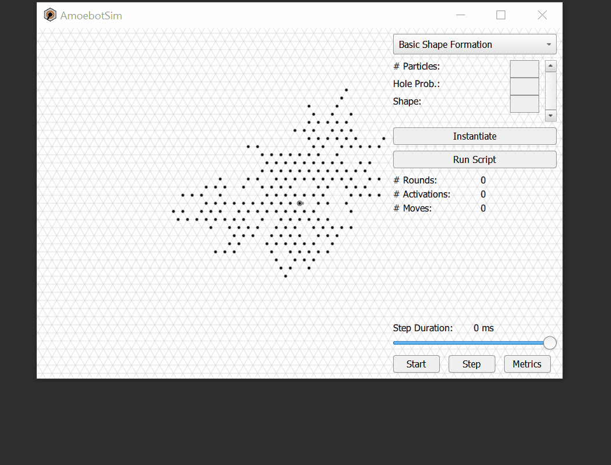

Scripting
=========

This scripting reference is for researchers 🧪 and developers 💻 learning how to write custom JavaScript experiments for AmoebotSim.

Instead of simply using the user interface controls to run a single algorithm instance, AmoebotSim also exposes a JavaScript interface that enables more programmatic and granular control of the simulator.
The scripting interface can be used to run large numbers of algorithm instances automatically and consecutively, adjust algorithm parameters more fluidly, capture metrics data for repeated runs, and lower runtime by streamlining graphics.

Writing Scripts
---------------

Writing custom JavaScript experiments for AmoebotSim uses standard JavaScript syntax, while additionally making use of custom commands specific to AmoebotSim (listed below in the :ref:`JavaScript API <script-api>`).
Here is an example of a simple JavaScript experiment:

.. code-block:: javascript

  for (var run = 0; run < 25; run++) {
    shapeformation(100, 0.2, "h");
    runUntilTermination();
    writeToFile('shapeformation_data.txt', getMetric("# Rounds") + '\n');
  }

In the above script, AmoebotSim runs 25 instances of the **Basic Shape Formation** algorithm (with given parameters), appending the value of the "# Rounds" metric at the end of each run to a text file.
This data could then be used, for example, to compute average runtime.

The simple scripting above can be expanded to carry out much more complex experiments.

Running Scripts
---------------

To run your JavaScript experiment, press the *Run Script* button in the sidebar and select the desired JavaScript file.
AmoebotSim will then begin executing your script, temporarily disabling graphics updates for faster execution.
When the script execution completes, graphics are reenabled and the following message will be logged to the simulator: ``Ran script: path_to_file/your_script.js``.

.. warning::
  All JavaScript experiment files must be saved within the directory containing AmoebotSim's executable.
  Otherwise, AmoebotSim's JavaScript engine will not be able to locate or execute the script.

.. note::
  AmoebotSim may temporarily hang (i.e., "Not Responding" on Windows or the faded window and rainbow pinwheel on macOS) while the script is executing.
  This is expected behavior, and is simply acknowledging that graphics are not currently being updating.

The following animation illustrates the process of loading and running a script in AmoebotSim:

.. _script-api:

Scripting API
-------------

The following is a list of all recognized commands.

.. note::
  All file path parameters for the JavaScript API are relative to the directory containing AmoebotSim's executable.

Algorithm Instantiation Commands
^^^^^^^^^^^^^^^^^^^^^^^^^^^^^^^^

All algorithms are instantiated based on their signatures and parameters defined when :ref:`registering the algorithm <disco-register>`.

.. js:function:: discodemo(numParticles, counterMax)

  :param int numParticles: The number of particles in the system.
  :param int counterMax: The maximum counter value for the color changes.

  Instantiates a system running the **DiscoDemo** algorithm with the given parameters.

.. js:function:: metricsdemo(numParticles, counterMax)

  :param int numParticles: The number of particles in the system.
  :param int counterMax: The maximum counter value for the color changes.

  Instantiates a system running the **MetricsDemo** algorithm with the given parameters.

.. js:function:: ballroomdemo(numParticles)

  :param int numParticles: The number of particles in the system.

  Instantiates a system running the **BallroomDemo** algorithm with the given parameter.

.. js:function:: tokendemo(numParticles, lifetime)

  :param int numParticles: The number of particles in the system.
  :param int lifetime: The total number of times a token should be passed.

  Instantiates a system running the **TokenDemo** algorithm with the given parameters.

.. js:function:: dynamicdemo(numParticles, growProb, dieProb)

  :param int numParticles: The number of particles in the system.
  :param float growProb: The probability of adding a new particle on activation.
  :param float dieProb: The probability of removing this particle on activation.

  Instantiates a system running the **DynamicDemo** algorithm with the given parameters.

.. js:function:: compression(numParticles, lambda)

  :param int numParticles: The number of particles in the system.
  :param int lambda: The bias parameter.

  Instantiates a system running the **Compression** algorithm with the given parameters.

.. js:function:: energyshape(numParticles, numEnergyRoots, holeProb, capacity, demand, transferRate)

  :param int numParticles: The number of particles in the system.
  :param int numEnergyRoots: The number of particles with access to external energy sources.
  :param float holeProb: The system's hole probability capturing how spread out the initial configuration is.
  :param float capacity: The capacity of each particle's battery.
  :param float demand: The energy cost for each particle's actions.
  :param float transferRate: The maximum amount of energy a particle can transfer to a neighbor.

  Instantiates a system running the **Energy Sharing** algorithm composed with **Hexagon Formation** with the given parameters.

.. js:function:: energysharing(numParticles, numEnergyRoots, usage, capacity, demand, transferRate)

  :param int numParticles: The number of particles in the system.
  :param int numEnergyRoots: The number of particles with access to external energy sources.
  :param int usage: Whether the system uses energy for "invisible" actions (``usage = 0``) or for reproduction (``usage = 1``).
  :param float capacity: The capacity of each particle's battery.
  :param float demand: The energy cost for each particle's actions.
  :param float transferRate: The maximum amount of energy a particle can transfer to a neighbor.

  Instantiates a system running the **Energy Sharing** algorithm with the given parameters.

.. js:function:: infobjcoating(numParticles, holeProb)

  :param int numParticles: The number of particles in the system.
  :param float holeProb: The system's hole probability capturing how spread out the initial configuration is.

  Instantiates a system running the **Infinite Object Coating** algorithm with the given parameters.

.. js:function:: leaderelection(numParticles, holeProb)

  :param int numParticles: The number of particles in the system.
  :param float holeProb: The system's hole probability capturing how spread out the initial configuration is.

  Instantiates a system running the **Leader Election** algorithm with the given parameters.

.. js:function:: shapeformation(numParticles, holeProb, mode)

  :param int numParticles: The number of particles in the system.
  :param float holeProb: The system's hole probability capturing how spread out the initial configuration is.
  :param string mode: The desired shape to form: ``"h"`` for hexagon, ``"s"`` for square, ``"t1"`` for vertex triangle, ``"t2"`` for centered triangle, and ``"l"`` for line.

  Instantiates a system running the **Basic Shape Formation** algorithm with the given parameters.

Scripting Commands
^^^^^^^^^^^^^^^^^^

.. js:function:: log(msg, error)

  :param string msg: A message to log to AmoebotSim's interface.
  :param boolean error: ``true`` if and only if this is an error message; ``false`` by default.

  Emits the message ``msg`` to the status bar.
  Can be denoted as an error message (red background) by setting ``error`` to ``true``.

.. js:function:: runScript(scriptFilePath)

  :param string scriptFilePath: The file path (relative to AmoebotSim's executable directory) of a JavaScript script.

  Loads a JavaScript script from ``scriptFilePath`` and executes it.

.. js:function:: writeToFile(filePath, text)

  :param string filePath: The path of a file to write text to.
  :param string text: The string to append to the specified file.

  Appends the specified ``text`` to a file at the given location ``filePath``.

Simulation Flow Commands
^^^^^^^^^^^^^^^^^^^^^^^^

.. js:function:: step()

  Executes a single particle activation.
  Equivalent to pressing the *Step* button or using ``Ctrl+D``/``Cmd+D``.

.. js:function:: setStepDuration(ms)

  :param int ms: The number of milliseconds (positive integer) between individual particle activations.

  Sets the simulator's delay between particle activations to the given value ``ms``.

.. js:function:: runUntilTermination()

  Runs the current algorithm instance until its ``hasTerminated`` function returns true.

Metrics Commands
^^^^^^^^^^^^^^^^

.. js:function:: getNumParticles()

  :returns: The number of particles in the system in the given instance.

.. js:function:: getNumObjects()

  :returns: The number of objects in the system in the given instance.

.. js:function:: getMetric(name, history)

  :param string name: The name of a metric.
  :param boolean history: ``true`` to return the metric's history or ``false`` to return the metric's current value; ``false`` by default.
  :returns: An array of the metric's value(s).

  For a metric with specified ``name``, returns either its current value (``history = false``) or historical data (``history = true``).

.. js:function:: exportMetrics()

  Writes all metrics data to JSON as ``metrics/metrics_<secs_since_epoch>.json``.
  Equivalent to pressing the *Metrics* button or using ``Ctrl+E``/``Cmd+E``.

Visualization Commands
^^^^^^^^^^^^^^^^^^^^^^

.. js:function:: setWindowSize(width, height)

  :param int width: The width in pixels; 800 by default.
  :param int height: The height in pixels; 600 by default.

  Sets the size of the application window to the specified ``width`` and ``height``.

.. js:function:: focusOn(x, y)

  :param int x: An *x*-coordinate on the triangular lattice.
  :param int y: A *y*-coordinate on the triangular lattice.

  Sets the window's center of focus to the given (``x``, ``y``) node.
  Zoom level is unaffected.

.. js:function:: setZoom(zoom)

  :param float zoom: A value defining the level/amount of zoom.

  Sets the zoom level of the window to the given value ``zoom``.

.. js:function:: saveScreenshot(filePath)

  :param string filePath: The file path/name to save the captured image; ``amoebotsim_<secs_since_epoch>.png`` by default.

  Saves the current window as a .png at file location ``filePath``.

.. js:function:: filmSimulation(filePath, stepLimit)

  :param string filePath: The file path location to save captured images.
  :param int stepLimit: The number of simulation steps to run and capture.

  Saves a series of screenshots to the specified location ``filePath``, up to the specified number of steps ``stepLimit``.
