Tutorials
=========

These tutorials are for researchers 🧪 and developers 💻 wanting to implement distributed algorithms for programmable matter in AmoebotSim.
As a prerequisite, make sure you've followed the instructions in the :doc:`Installation Guide </install/install>` so that everything builds and runs correctly.
Additionally, you should be comfortable with how the `amoebot model <https://sops.engineering.asu.edu/sops/amoebot/>`_ is defined.

All tutorials can be found in the ``alg/demo/`` directory of AmoebotSim so you can build and run them yourself.
Note that the coding style in these tutorials follows our :ref:`C++ Style Guide <cpp-style>` which we will not re-explain here.

Anatomy of AmoebotSim
---------------------

AmoebotSim is organized into seven main directories that loosely collect similar classes.

* ``alg/`` contains all classes defining the amoebot model's distributed algorithms. If you're a researcher or developer hoping to implement your own algorithms in AmoebotSim, this is where they'll live.

  * ``demo/`` is a subdirectory of ``alg/`` containing example algorithms that, coupled with the documentation in this Tutorials page, act as the demos that new AmoebotSim developers can learn from.

* ``core/`` contains the core elements of AmoebotSim, including the base classes for particles and particle systems.

* ``docs/`` contains the source files for this documentation.

* ``helper/`` contains utility classes that interface with various C++ libraries on behalf of the particle algorithms.

* ``main/`` contains the main driver and ``Application`` class, which is responsible for connecting the front end GUI to the back end implementation. Only developers modifying the GUI will need to work with this class.

* ``res/`` contains AmoebotSim's resources, including textures for graphics rendering, icons, GUI layout, etc.

* ``script/`` contains the classes used for interpreting and executing commands issued to AmoebotSim via its :ref:`JavaScript API <script-api>`.

* ``ui/`` contains the classes used for front end GUI rendering and visualization.

The most important classes for implemeting new distributed algorithms in AmoebotSim are:

* ``Node`` (in ``core/node.h``) describes the ``(x,y)`` nodes of the triangular lattice.

* ``Object`` (in ``core/object.h``) describes a single node of a static object.

* ``Particle`` (in ``core/particle.*``) describes the most basic form of a particle, essentially reducing this entity to the node(s) it occupies.

* ``LocalParticle`` (in ``core/localparticle.*``) is a child class of ``Particle`` that adds functions for observing and using local information. In particular, these functions focus on obscuring global directions from a particle so that everything it sees is from its own local perspective. There are also functions for "cheating" and accessing some level of global information, if desired; however, these are meant only for convenience and are not compliant with the assumptions of the amoebot model.

* ``AmoebotParticle`` (in ``core/amoebotparticle.*``) is a child class of ``LocalParticle`` that adds functions for particle activations, particle movements, and token passing. All particles running new algorithms inherit from this class.

* ``AmoebotSystem`` (in ``core/amoebotsystem.*``) is a glorified container of ``AmoebotParticles`` that keeps track of the particle system's size, position, and progress. All particle systems running new algorithms inherit from this class.

.. _disco-demo:

DiscoDemo: Your First Algorithm
-------------------------------

We'll be developing a fun (but not particularly useful) algorithm called **DiscoDemo** where particles will move within a boundary, changing colors as they go.
You can follow along with this tutorial by referencing the completed ``alg/demo/discodemo.*`` files in AmoebotSim; this tutorial shows how to develop this simulation from scratch.

.. _disco-pseudocode:

Algorithm Pseudocode
^^^^^^^^^^^^^^^^^^^^

All algorithms for the amoebot model are defined at the particle level, and all particles run an instance of the same algorithm (this is where the "distributed computing" perspective comes in).
So when we write algorithm pseudocode, we always write it from the perspective of a single particle, *not* from the system's perspective!

For **DiscoDemo**, every particle will keep a state ``color`` and a counter ``ctr`` that decrements each time it is activated.
When ``ctr = 0``, the particle will change its ``color``.
Here's the color-changing part of the pseudocode for a particle ``P``::

  P.ctr <- P.ctr - 1
  if (P.ctr is 0), then do:
    P.ctr <- CTR_MAX  // Reset the counter.
    P.color <- getRandColor()
  end if

We'd also like our particles to "dance" around in the boundary.
We'll achieve this using the amoebot model's expansion and contraction movements.
However, the amoebot model doesn't allow multiple particles to be on the same node, so we need to be careful not to let particles expand into nodes that are already occupied::

  if (P is contracted), then do:
    expandDir <- random direction in [0, 6)
    if (node in direction expandDir is empty), then do:
      expand towards expandDir
    end if
  else, do:  // P is expanded
    contract tail
  end if

Some caveats related to **DiscoDemo**'s compliance with the amoebot model:

- The amoebot model assumes that each particle only has constant-size memory, which has two implications for our algorithm: (1) ``CTR_MAX`` should be a constant value, e.g., "5", and (2) the number of colors that can be returned by ``getRandColor()`` must also be constant. We'll use {R, O, Y, G, B, I, V} (`what? <https://en.wikipedia.org/wiki/ROYGBIV>`_).
- Many algorithms for the amoebot model are designed to keep the particle system connected, but the particles running **DiscoDemo** will definitely disconnect from one another because they're moving in random directions. This is why we have the static boundary: to corral all those particles and keep them from diffusing into infinity!

Creating the Files
^^^^^^^^^^^^^^^^^^

All algorithms in AmoebotSim come in header/source file pairs, and live within the ``alg/`` directory.
The file naming convention is ``<algorithmname>.h`` and ``<algorithmname>.cpp``.
For example, the Compression algorithm is simulated in the files ``alg/compression.h`` and ``alg/compression.cpp``.
In our case, because our Disco algorithm is meant for demonstration, we will create its two files in the ``alg/demo/`` directory: ``alg/demo/discodemo.h`` and ``alg/demo/discodemo.cpp``.

Importantly, because this is a Qt project, we need to use Qt's *"Add New..."* dialog (shown below).
In addition to simply creating the files, this process automatically adds them to AmoebotSim's ``.pro`` file which indexes the project files for compilation.

First, right-click on the folder to add the files to (in our case, this is ``alg/demo/``). Select *"Add New..."*.

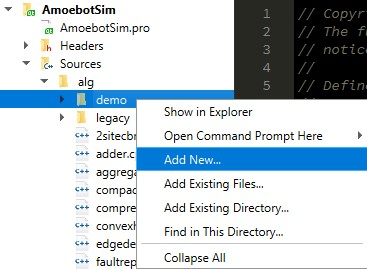

Next, in the C++ tab, choose *"C++ Source File"*.
We don't use the *"C++ Class"* option because our classes do not always match the filenames (for reasons that will become clear in just a few steps).

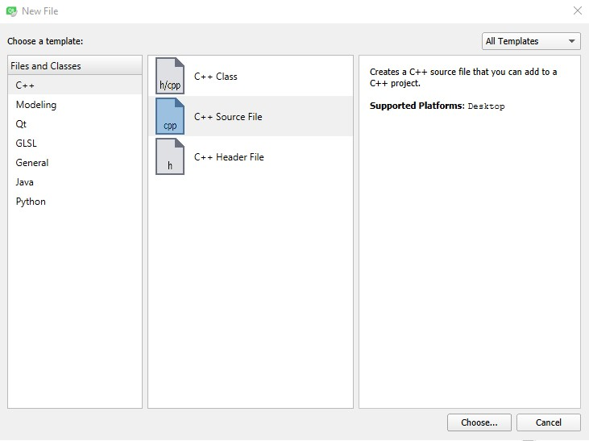

Specify the filename and click *"Next"*.

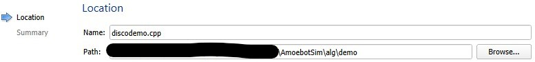

The source file ``discodemo.cpp`` is now in the ``alg/demo/`` directory and has been added to the ``AmoebotSim.pro`` file's ``SOURCES`` list.

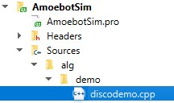

Repeat these steps for the header file ``discodemo.h`` using the *"C++ Header File"* option in the *"Add New..."* dialog.

The Header File
^^^^^^^^^^^^^^^

This section assumes you've read the :ref:`C++ Style Guide <cpp-style>` in our development guide.
We begin by setting up the header file's structure, which includes the following elements:

- A `class comment <https://google.github.io/styleguide/cppguide.html#Class_Comments>`_ that includes the copyright notice, a brief description of the class(es) this file contains, and any relevant publications/references. **DiscoDemo** doesn't have a publication, but we'll add a reference to this code tutorial.

- `#define guards <https://google.github.io/styleguide/cppguide.html#The__define_Guard>`_ of the form ``<PROJECT>_<PATH>_<FILE>_<H>_``. In our case, this is ``AMOEBOTSIM_ALG_DEMO_DISCODEMO_H_``.

- Any ``#includes`` grouped in order of standard C/C++ libraries, then any Qt libraries, and finally any AmoebotSim-specific headers. Each group is ordered alphabetically. For **DiscoDemo**, we only need the core ``AmoebotParticle`` and ``AmoebotSystem`` classes, which are used in essentially every algorithm.

- The two classes for **DiscoDemo**: a particle class ``DiscoDemoParticle`` that inherits from ``AmoebotParticle``, and a particle system class ``DiscoDemoSystem`` that inherits from ``AmoebotSystem``.

With all these elements in place, we have the following:

.. code-block:: c++

  /* Copyright (C) 2021 Joshua J. Daymude, Robert Gmyr, and Kristian Hinnenthal.
   * The full GNU GPLv3 can be found in the LICENSE file, and the full copyright
   * notice can be found at the top of main/main.cpp. */

  // Defines the particle system and composing particles for the Disco code
  // tutorial, a first algorithm for new developers to AmoebotSim. Disco
  // demonstrates the basics of algorithm architecture, instantiating a particle
  // system, moving particles, and changing particles' states. The pseudocode is
  // available in the docs:
  // [https://amoebotsim.rtfd.io/en/latest/tutorials/tutorials.html#discodemo-your-first-algorithm].

  #ifndef AMOEBOTSIM_ALG_DEMO_DISCODEMO_H_
  #define AMOEBOTSIM_ALG_DEMO_DISCODEMO_H_

  #include "core/amoebotparticle.h"
  #include "core/amoebotsystem.h"

  class DiscoDemoParticle : public AmoebotParticle {

  };

  class DiscoDemoSystem : public AmoebotSystem {

  };

  #endif  // AMOEBOTSIM_ALG_DEMO_DISCODEMO_H_

Next, we need to fill out our classes' member variables and functions.
It's helpful to be familiar with the parent classes' variables and functions when defining our own so we don't waste time implementing functionality that already exists.
Reviewing our :ref:`pseudocode <disco-pseudocode>`, every `DiscoDemoParticle` will need the following:

- A variable to store its state (color). We'll call this ``State _state``, where ``State`` is a custom type we'll define shortly.

- Variables to store its current counter value (``int _counter``) and the maximum counter value (``const int _counter_max``).

- The ability to generate a new color at random. We'll define a function with the signature ``State getRandColor() const``.

- The ability to check if it is contracted or expanded. These already exist as ``isContracted()`` and ``isExpanded()`` in ``Particle``, which is inherited by ``LocalParticle``, which is inherited by ``AmoebotParticle``, which is inherited by our ``DiscoDemoParticle``. So we don't need to implement these again.

- The ability to generate a random direction in [0,6). This already exists as ``randDir()`` in ``RandomNumberGenerator``, which is inherited by ``AmoebotParticle``, which is inherited by our ``DiscoDemoParticle``.

- The ability to check if a node in a given direction is unoccupied. This already exists as ``canExpand(int)`` in ``AmoebotParticle``.

- The ability to expand in a given direction and contract its tail. These already exist as ``expand(int)`` and ``contractTail()``, respectively, in ``AmoebotParticle``.

The variables and functions that we do need to implement are specific to ``DiscoDemoParticle``, so we can make them ``protected`` instead of ``public``.

.. code-block:: c++

  class DiscoDemoParticle : public AmoebotParticle {
   public:

   protected:
    // Returns a random State.
    State getRandColor() const;

    // Member variables.
    State _state;
    int _counter;
    const int _counterMax;

   private:
  };

For the ``public`` members, we need:

- A definition for the custom type ``State``. We'll use an `enumeration class <https://www.learncpp.com/cpp-tutorial/4-5a-enum-classes/>`_ to define a type-safe set of possible states; in our case, this is a set of colors.

- A constructor. Every class that inherits from ``AmoebotParticle`` should at least take a ``const Node head``, ``const int globalTailDir``, ``const int orientation``, and ``AmoebotSystem& system`` as inputs to its constructor, but can additionally take algorithm-specific information. For **DiscoDemo**, we'll additionally take a maximum counter value ``const int counterMax``.

- A function handling what a ``DiscoDemoParticle`` does when it's activated. This is achieved by overriding the ``activate()`` function from ``AmoebotParticle``.

- A function handling the visual color changes for a ``DiscoDemoParticle``'s head and tail nodes. This is achieved by overriding the ``headMarkColor()`` and ``tailMarkColor()`` functions from ``Particle``.

- A function handling the text that appears when inspecting a ``DiscoDemoParticle`` (see the :ref:`Controls <controls>` section of the usage guide). This is achieved by overriding the ``inspectionText()`` function from ``Particle``.

As a ``private`` declaration, we need to name ``DiscoDemoSystem`` as a ``friend`` class.
All together, we have:

.. code-block:: c++

  class DiscoDemoParticle : public AmoebotParticle {
   public:
    enum class State {
      Red,
      Orange,
      Yellow,
      Green,
      Blue,
      Indigo,
      Violet
    };

    // Constructs a new particle with a node position for its head, a global
    // compass direction from its head to its tail (-1 if contracted), an offset
    // for its local compass, a system that it belongs to, and a maximum value for
    // its counter.
    DiscoDemoParticle(const Node& head, const int globalTailDir,
                      const int orientation, AmoebotSystem& system,
                      const int counterMax);

    // Executes one particle activation.
    void activate() override;

    // Functions for altering the particle's color. headMarkColor() (resp.,
    // tailMarkColor()) returns the color to be used for the ring drawn around the
    // particle's head (resp., tail) node. In this demo, the tail color simply
    // matches the head color.
    int headMarkColor() const override;
    int tailMarkColor() const override;

    // Returns the string to be displayed when this particle is inspected; used to
    // snapshot the current values of this particle's memory at runtime.
    QString inspectionText() const override;

   protected:
    // ...

   private:
    friend class DiscoDemoSystem;
  };

Finally, we need to define a constructor for ``DiscoDemoSystem``.
This constructor will take the desired number of particles in the system as well as the maximum counter value.
We also provide some default parameter values.

.. code-block:: c++

  class DiscoDemoSystem : public AmoebotSystem {
   public:
    // Constructs a system of the specified number of DiscoDemoParticles enclosed
    // by a hexagonal ring of objects.
    DiscoDemoSystem(unsigned int numParticles = 30, int counterMax = 5);
  };

The Source File
^^^^^^^^^^^^^^^

The source file has a fairly straightforward structure.
It begins with the copyright notice and an ``#include`` of the header file, and then simply lists the functions to be implemented with their scopes:

.. code-block:: c++

  /* Copyright (C) 2021 Joshua J. Daymude, Robert Gmyr, and Kristian Hinnenthal.
   * The full GNU GPLv3 can be found in the LICENSE file, and the full copyright
   * notice can be found at the top of main/main.cpp. */

  #include "alg/demo/discodemo.h"

  DiscoDemoParticle::DiscoDemoParticle(const Node& head, const int globalTailDir,
                                       const int orientation,
                                       AmoebotSystem& system,
                                       const int counterMax) {}

  void DiscoDemoParticle::activate() {}

  int DiscoDemoParticle::headMarkColor() const {}

  int DiscoDemoParticle::tailMarkColor() const {}

  QString DiscoDemoParticle::inspectionText() const {}

  DiscoDemoParticle::State DiscoDemoParticle::getRandColor() const {}

  DiscoDemoSystem::DiscoDemoSystem(unsigned int numParticles, int counterMax) {}

We'll detail each function implementation in order.

``DiscoDemoParticle``'s constructor is fairly straightforward.
We can use an `initializer list <https://google.github.io/styleguide/cppguide.html#Constructor_Initializer_Lists>`_ to initialize ``_counter`` and ``_counterMax`` both to the maximum counter value.
We then set this particle's ``_state`` to a random initial color.

.. code-block:: c++

  DiscoDemoParticle::DiscoDemoParticle(const Node& head, const int globalTailDir,
                                       const int orientation,
                                       AmoebotSystem& system,
                                       const int counterMax)
      : AmoebotParticle(head, globalTailDir, orientation, system),
        _counter(counterMax),
        _counterMax(counterMax) {
    _state = getRandColor();
  }

The implementation of ``activate()`` simply follows the :ref:`pseudocode <disco-pseudocode>` we detailed before.
As an aside, AmoebotSim does not prohibit the ``activate()`` function from allowing a particle to do more than what is allowed by the amoebot model, such as letting a particle make more than one expansion or contraction in a single activation.
It is up to the algorithm designer and simulation developer to ensure no rules of the amoebot model are violated.

.. code-block:: c++

  void DiscoDemoParticle::activate() {
    // First decrement the particle's counter. If it's zero, reset the counter and
    // get a new color.
    _counter--;
    if (_counter == 0) {
      _counter = _counterMax;
      _state = getRandColor();
    }

    // Next, handle movement. If the particle is contracted, choose a random
    // direction to try to expand towards, but only do so if the node in that
    // direction is unoccupied. Otherwise, if the particle is expanded, simply
    // contract its tail.
    if (isContracted()) {
      int expandDir = randDir();
      if (canExpand(expandDir)) {
        expand(expandDir);
      }
    } else {  // isExpanded().
      contractTail();
    }
  }

The implementation of ``headMarkColor()`` uses the particle's ``_state`` (color) to decide what color to use when rendering its head node.
All colors are expressed in RGB format as 6-digit hexadecimal numbers: ``0x<rr><bb><gg>``. For example, the color red is ``0xff0000`` while the color black is ``0x000000``.
If no color (transparent) is desired, return ``-1``.

.. code-block:: c++

  int DiscoDemoParticle::headMarkColor() const {
    switch(_state) {
      case State::Red:    return 0xff0000;
      case State::Orange: return 0xff9000;
      case State::Yellow: return 0xffff00;
      case State::Green:  return 0x00ff00;
      case State::Blue:   return 0x0000ff;
      case State::Indigo: return 0x4b0082;
      case State::Violet: return 0xbb00ff;
    }

    return -1;
  }

The implementation of ``tailMarkColor()`` simply mirrors ``headMarkColor()``:

.. code-block:: c++

  int DiscoDemoParticle::tailMarkColor() const {
    return headMarkColor();
  }

The implementation of ``inspectionText()`` concatenates a series of strings describing the particle's global information (position, orientation, and tail direction) in addition to its local information (current state and counter value).
Here, a lambda function is used to encapsulate the switch statement because it is more concise, but could just as easily be implemented using a long ``if``/``else if``/``else`` chain.

.. code-block:: c++

  QString DiscoDemoParticle::inspectionText() const {
    QString text;
    text += "Global Info:\n";
    text += "  head: (" + QString::number(head.x) + ", "
                        + QString::number(head.y) + ")\n";
    text += "  orientation: " + QString::number(orientation) + "\n";
    text += "  globalTailDir: " + QString::number(globalTailDir) + "\n\n";
    text += "Local Info:\n";
    text += "  state: ";
    text += [this](){
      switch(_state) {
        case State::Red:    return "red\n";
        case State::Orange: return "orange\n";
        case State::Yellow: return "yellow\n";
        case State::Green:  return "green\n";
        case State::Blue:   return "blue\n";
        case State::Indigo: return "indigo\n";
        case State::Violet: return "violet\n";
      }
      return "no state\n";
    }();
    text += "  counter: " + QString::number(_counter);

    return text;
  }

The implementation of ``getRandColor()`` uses ``RandomNumberGenerator``'s ``randInt()`` function to choose a random index in [0,7) (where 7 is the number of states).
It then casts this index as a ``State``, effectively choosing a random color.
Note that although enumeration classes (like ``State``) are not ``ints``, they can be safely casted back and forth using ``static_cast``.

.. code-block:: c++

  DiscoDemoParticle::State DiscoDemoParticle::getRandColor() const {
    // Randomly select an integer and return the corresponding state via casting.
    return static_cast<State>(randInt(0, 7));
  }

Finally, we need to implement ``DiscoDemoSystem``'s constructor.
At a high level, the goal of this function is to create a closed boundary of ``Objects`` in the shape of a regular hexagon and then place the desired number of ``DiscoDemoParticles`` randomly inside that boundary.
Before diving into the details, there are several useful functions to be familiar with:

- ``insert()`` is defined by ``AmoebotSystem``. It takes as input a pointer to an ``Object`` or to an ``AmoebotParticle``. This is what's used to add ``Objects`` or ``DiscoDemoParticles`` to the ``DiscoDemoSystem``.

- ``nodeInDir()`` is defined by ``Node``. It returns the node adjacent to the one calling the function in the given global direction, where direction ``0`` is to the right and directions increase counterclockwise.

- ``randInt()`` and ``randDir()`` are both defined by ``RandomNumberGenerator``, and are used to get random values.

.. _disco-system-constructor:

Let's first look at the code used to create the hexagonal boundary.

.. code-block:: c++

  // In order to enclose an area that's roughly 3.7x the # of particles using a
  // regular hexagon, the hexagon should have side length 1.4*sqrt(# particles).
  int sideLen = static_cast<int>(std::round(1.4 * std::sqrt(numParticles)));
  Node boundNode(0, 0);
  for (int dir = 0; dir < 6; ++dir) {
    for (int i = 0; i < sideLen; ++i) {
      insert(new Object(boundNode));
      boundNode = boundNode.nodeInDir(dir);
    }
  }

A brief primer on how AmoebotSim treats its coordinate system will be helpful to understand the rest of this code.
AmoebotSim assigns an ``(x,y)`` coordinate to each node on the triangular lattice.
The origin ``(0,0)`` is fixed, and from this point the x-axis increases to the right and decreases to the left while the y-axis increases to the up-right and decreases to the down-left.
Think of it as a usual Cartesian grid that's been squished to the right.

We need the boundary of our ``DiscoDemoSystem`` to be big enough so that the particles have reasonable room to "dance" around, but not so big that the dance floor feels empty.
Some elementary geometry would tell you that the area of a regular hexagon is ``3s^2 * sqrt(3) / 2``, where ``s`` is the side length.
So if we wanted our boundary to enclose an area ``C`` times the number of particles ``n``, some algebra shows us that the side length has to be ``sqrt(2Cn / (3sqrt(3)))``.
This is where the ``3.7x`` and ``1.4`` come from in the code above: setting ``C = 3.7`` means that ``s ~ 1.4 * sqrt(n)``.

Now that we know how long each side should be, we start at node ``(0,0)``.
The outer ``for`` loop controls the direction we're adding boundary nodes, while the inner ``for`` loop ensures we add the right number of boundary nodes to each side.
In words, these ``for`` loops add ``s`` boundary nodes starting at ``(0,0)`` and going right, then ``s`` nodes going up-right, then ``s`` nodes going up-left, and so on until the boundary is closed.

Since we started at ``(0,0)``, we have the following boundaries for our hexagon:

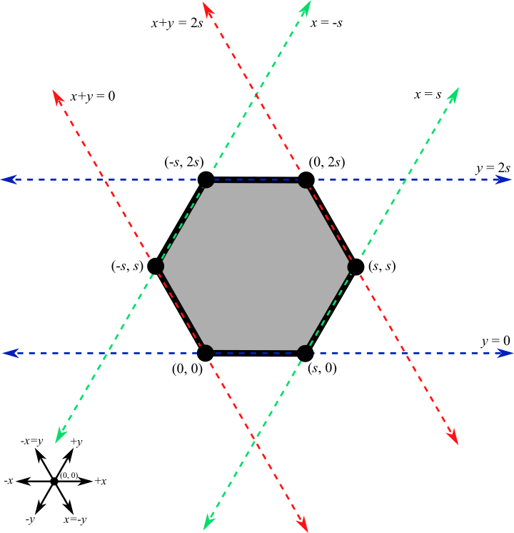

All that remains is to choose a node ``(x,y)`` at random with ``-s < x < s`` and ``0 < y < 2s`` and place a particle there as long as the node is inside the boundary and unoccupied.
This process is repeated until the desired number of particles has been placed.

.. code-block:: c++

  // Let s be the bounding hexagon side length. When the hexagon is created as
  // above, the nodes (x,y) strictly within the hexagon have (i) -s < x < s,
  // (ii) 0 < y < 2s, and (iii) 0 < x+y < 2s. Choose interior nodes at random to
  // place particles, ensuring at most one particle is placed at each node.
  std::set<Node> occupied;
  while (occupied.size() < numParticles) {
    // First, choose an x and y position at random from the (i) and (ii) bounds.
    int x = randInt(-sideLen + 1, sideLen);
    int y = randInt(1, 2 * sideLen);
    Node node(x, y);

    // If the node satisfies (iii) and is unoccupied, place a particle there.
    if (0 < x + y && x + y < 2 * sideLen
        && occupied.find(node) == occupied.end()) {
      insert(new DiscoDemoParticle(node, -1, randDir(), *this, counterMax));
      occupied.insert(node);
    }
  }

Here, we use a ``std::set<Node> occupied`` to keep track of the nodes that are occupied by placed particles, and use the condition ``occupied.find(node) == occupied.end()`` to check that the node in question is not already occupied by a particle.
This sort of logic is fairly common in many other algorithms' particle system constructors.

.. _disco-register:

Registering the Algorithm
^^^^^^^^^^^^^^^^^^^^^^^^^

With the header and source files completed, we're nearly done with the **DiscoDemo** simulation.
The last (small) bit of work to do is to register **DiscoDemo** with AmoebotSim so it can be run from the GUI.
The first files we need to update are ``ui/algorithm.h`` and ``ui/algorithm.cpp``.
In ``ui/algorithm.h``, we add an ``Algorithm`` child class to represent **DiscoDemo** with a constructor and an ``instantiate()`` function.
The ``instantiate()`` function should have the same parameters as ``DiscoDemoSystem``'s constructor.

.. code-block:: c++

  // Demo: Disco, a first tutorial.
  class DiscoDemoAlg : public Algorithm {
    Q_OBJECT

   public:
    DiscoDemoAlg();

   public slots:
    void instantiate(const int numParticles = 30, const int counterMax = 5);
  };

In ``ui/algorithm.cpp``, we first implement the ``DiscoDemoAlg()`` constructor.
This first calls the parent constructor ``Algorithm(<name>, <signature>)``, which takes two parameters: a *human-readable name* for the algorithm to put in the algorithm selection dropdown, and an algorithm *signature* to be used internally by the simulator.
Here, we use *"Demo: Disco"* as the name and *"discodemo"* as the signature.
Next, we add a human-readable name and a default value for each of the algorithm's parameters using ``addParameter(<name>, <default value>)``; these parameters should match what was used in the ``instantiate()`` function.
Note that the default values should always be given as a string (e.g., *"30"*).

.. code-block:: c++

  DiscoDemoAlg::DiscoDemoAlg() : Algorithm("Demo: Disco", "discodemo") {
    addParameter("# Particles", "30");
    addParameter("Counter Max", "5");
  };

Next, we implement the ``instantiate()`` function.
This essentially has two parts: parameter checking (to ensure we don't pass our algorithm bad parameters that might crash AmoebotSim) and instantiating the system (achieved using ``Simulator``'s ``setSystem()`` function).
Here, we use ``log()`` to show error messages to the user if one of their parameters is bad.

.. code-block:: c++

  void DiscoDemoAlg::instantiate(const int numParticles, const int counterMax) {
    if (numParticles <= 0) {
      log("# particles must be > 0", true);
    } else if (counterMax <= 0) {
      log("counterMax must be > 0", true);
    } else {
      sim.setSystem(std::make_shared<DiscoDemoSystem>(numParticles));
    }
  }

One last addition to ``ui/algorithm.cpp``: we need to construct an instance of our newly defined ``DiscoDemoAlg`` class and add it to AmoebotSim's algorithm list.
This will add **DiscoDemo** to the algorithm selection dropdown.

.. code-block:: c++

  // ...

  AlgorithmList::AlgorithmList() {
    // Demo algorithms.
    _algorithms.push_back(new DiscoDemoAlg());

    // ...

Finally, in ``ui/parameterlistmodel.cpp``, we need to parse the values given by the user in the sidebar's parameter input boxes.
All parameter values are input as strings, but need to be cast to their correct data types as defined by ``instantiate()``.

.. code-block:: c++

  void ParameterListModel::createSystem(QString algName) {
    // ...

    if (signature == "discodemo") {
      dynamic_cast<DiscoDemoAlg*>(alg)->
          instantiate(params[0].toInt(), params[1].toInt());
    } else if (signature ==  // ...

Compiling and running AmoebotSim after these steps will allow you to instantiate the **DiscoDemo** simulation using the sidebar interface.

Congratulations, you've implemented your first simulation on AmoebotSim!

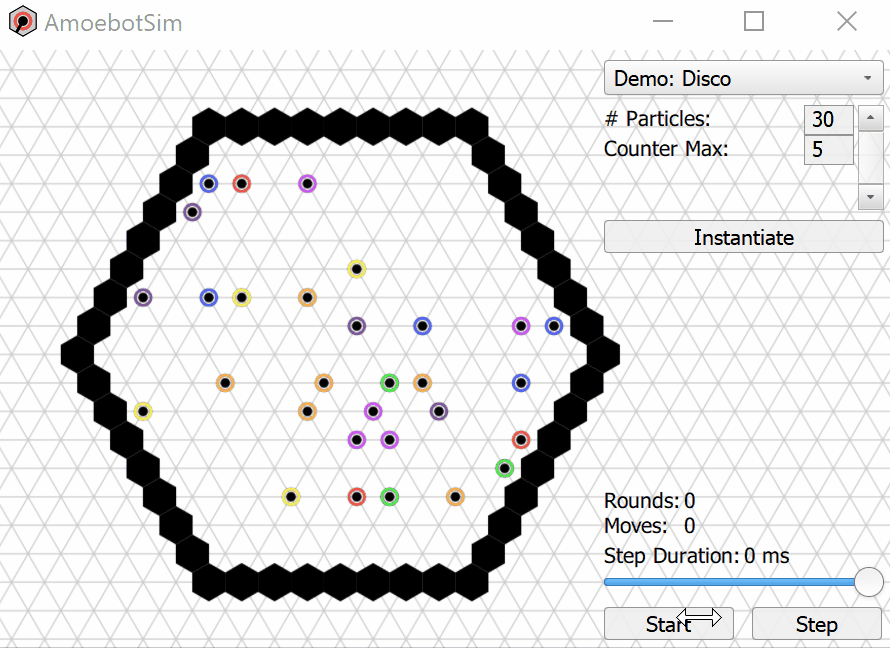

.. _ballroom-demo:

BallroomDemo: Working Together
----------------------------------

In this tutorial, you will learn how to implement particle communication and coordinated movements.
We'll be developing **BallroomDemo**, an algorithm where pairs of particles move together within a boundary.
You can follow along with this tutorial by referencing the completed ``alg/demo/ballroomdemo.*`` files in AmoebotSim.
This tutorial assumes you have read and are comfortable with the **DiscoDemo** :ref:`tutorial <disco-demo>`.

A Primer on Particle Coordination
^^^^^^^^^^^^^^^^^^^^^^^^^^^^^^^^^

In the amoebot model, particles coordinate by communicating with their neighbors (i.e., reading and writing constant amounts of information) and performing coordinated movements called *handovers*.
The key AmoebotSim function for communication is ``nbrAtLabel(label)`` which returns a reference to the neighboring particle incident to label ``label``, if such a particle exists.
As we will see, reading and writing can both be achieved using this function.
Moreover, there are two types of handovers:

#. A *push* handover in which a contracted particle ``P`` expands into a node occupied by an expanded neighbor ``Q``, forcing ``Q`` to contract.

#. A *pull* handover in which an expanded particle ``Q`` contracts, forcing a contracted neighbor ``P`` to expand into the node it is vacating.

These handovers are symmetric and produce the same outcome; they only differ in which particle initiates.
For example, in the graphic below, the blue particle is either pushing or being pulled by the red particle.
In AmoebotSim, the conditions for pushing or pulling a neighbor at label ``label`` are checked by ``canPush(label)`` and ``canPull(label)``, respectively.
Similarly, performing the actual handover is done with ``push(label)`` and ``pull(label)``.

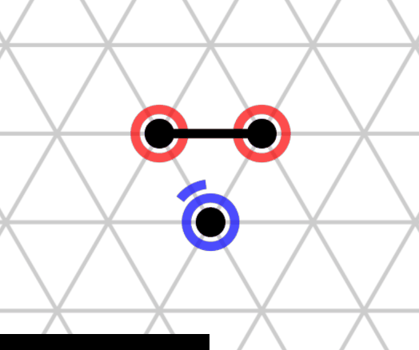

.. _ballroom-algorithm:

Algorithm Description
^^^^^^^^^^^^^^^^^^^^^

The goal of **BallroomDemo** is to coordinate pairs of Leader/Follower dance partners as they move around an arena.
The Leader will initiate a dance step by expanding in a random direction.
Either the Leader or Follower can then perform a handover, causing the Leader to contract and the Follower to expand.
Finally, the dance step completes with the Follower contracting.
These dance steps continue indefinitely.

To demonstrate communication, we add a ``color`` variable, similar to **DiscoDemo**.
All particles are initially assigned random colors.
Whenever a Follower succeeds in pushing its Leader, it first reads the Leader's color and compares it to its own.
If the Leader's color is different than the Follower's, the Follower adopts the Leader's color; otherwise, the Follower keeps its color and assigns a new random color to the Leader.

The pseudocode for a particle ``P`` is as follows:

.. code-block:: c++

  if P is the leader, then do:
    if P is contracted, then do:
      expandDir <- random direction in [0, 6)
      if (node in direction expandDir is empty), then do:
        expand towards expandDir
      end if
    else, do:  // P is expanded
      if the follower partner is contracted, then do:
        pull the follower partner
      end if
    end if
  else if P is the follower, then do:
    if P is contracted, then do:
      if the leader partner is expanded, then do:
        if leader.color != P.color, then do:
          P.color <- leader.color
        else, do:
          leader.color <- getRandColor()
        end if
        push the leader partner
      end if
    else, do:  // P is expanded
      contract tail
    end if
  end if

Setting Up the Files
^^^^^^^^^^^^^^^^^^^^

We begin by creating the ``alg/demo/ballroomdemo.h`` and ``alg/demo/ballroomdemo.cpp`` files and setting up their structure.
As with any other new particle or system type, we inherit from ``AmoebotParticle`` or ``AmoebotSystem``, respectively, and set up the necessary function overrides in ``alg/demo/ballroomdemo.h``.
The particle's ``_state`` variable will keep track of whether it is a leader (``State::Leader``) or follower (``State::Follower``), and ``_partnerLbl`` will be used by the follower to keep track of its partner leader.

.. code-block:: c++

  /* Copyright (C) 2021 Joshua J. Daymude, Robert Gmyr, and Kristian Hinnenthal.
  * The full GNU GPLv3 can be found in the LICENSE file, and the full copyright
  * notice can be found at the top of main/main.cpp. */

  // Defines the particle system and composing particles for the Ballroom code
  // tutorial, demonstrating inter-particle coordination. This tutorial covers
  // read/write functionality and pull/push handovers. The pseudocode is
  // available in the docs:
  // [https://amoebotsim.rtfd.io/en/latest/tutorials/tutorials.html#ballroomdemo-working-together].

  #ifndef AMOEBOTSIM_ALG_DEMO_BALLROOMDEMO_H_
  #define AMOEBOTSIM_ALG_DEMO_BALLROOMDEMO_H_

  #include <QString>

  #include "core/amoebotparticle.h"
  #include "core/amoebotsystem.h"

  class BallroomDemoParticle : public AmoebotParticle {
   public:
    enum class State {
      Leader,
      Follower
    };

    enum class Color {
      Red,
      Orange,
      Yellow,
      Green,
      Blue,
      Indigo,
      Violet
    };

    // Constructs a new particle with a node position for its head, a global
    // compass direction from its head to its tail (-1 if contracted), an offset
    // for its local compass, a system which it belongs to, and an initial state.
    BallroomDemoParticle(const Node head, const int globalTailDir,
                         const int orientation, AmoebotSystem& system,
                         State _state);

    // Executes one particle activation.
    void activate() override;

    // Functions for altering the particle's color. headMarkColor() (resp.,
    // tailMarkColor()) returns the color to be used for the ring drawn around the
    // particle's head (resp., tail) node. In this demo, the tail color simply
    // matches the head color. headMarkDir returns the label of the port
    // on which the head marker is drawn; in this demo, this points from the
    // follower dance partner to its leader.
    int headMarkColor() const override;
    int headMarkDir() const override;
    int tailMarkColor() const override;

    // Returns the string to be displayed when this particle is inspected; used
    // to snapshot the current values of this particle's memory at runtime.
    QString inspectionText() const override;

    // Gets a reference to the neighboring particle incident to the specified port
    // label. Crashes if no such particle exists at this label; consider using
    // hasNbrAtLabel() first if unsure.
    BallroomDemoParticle& nbrAtLabel(int label) const;

   protected:
    // Returns a random Color.
    Color getRandColor() const;

    // Member variables.
    const State _state;
    Color _color;
    int _partnerLbl;

   private:
    friend class BallroomDemoSystem;
  };

  class BallroomDemoSystem : public AmoebotSystem {
   public:
    // Constructs a system of the specified number of BallroomDemoParticles in
    // "dance partner" pairs enclosed by a rhombic ring of objects.
    BallroomDemoSystem(unsigned int numParticles = 30);
  };

  #endif  // AMOEBOTSIM_ALG_DEMO_BALLROOMDEMO_H_

The skeleton of ``alg/demo/ballroomdemo.cpp`` is straightforward.

.. code-block:: c++

  /* Copyright (C) 2021 Joshua J. Daymude, Robert Gmyr, and Kristian Hinnenthal.
   * The full GNU GPLv3 can be found in the LICENSE file, and the full copyright
   * notice can be found at the top of main/main.cpp. */

  #include "alg/demo/ballroomdemo.h"

  BallroomDemoParticle::BallroomDemoParticle(const Node head,
                                             const int globalTailDir,
                                             const int orientation,
                                             AmoebotSystem &system,
                                             State state)
    : AmoebotParticle(head, globalTailDir, orientation, system),
      _state(state),
      _partnerLbl(-1) {
    _color = getRandColor();
  }

  void BallroomDemoParticle::activate() {}

  int BallroomDemoParticle::headMarkColor() const {}

  int BallroomDemoParticle::headMarkDir() const {}

  int BallroomDemoParticle::tailMarkColor() const {}

  QString BallroomDemoParticle::inspectionText() const {}

  BallroomDemoParticle& BallroomDemoParticle::nbrAtLabel(int label) const {}

  BallroomDemoParticle::Color BallroomDemoParticle::getRandColor() const {}

  BallroomDemoSystem::BallroomDemoSystem(unsigned int numParticles) {}

Function Implementations
^^^^^^^^^^^^^^^^^^^^^^^^

We'll now implement each function, working from the simplest to the most complex.
We omit a detailed explanation of ``inspectionText()`` and ``getRandColor()`` since they are analogous to their versions in **DiscoDemo**; see ``alg/demo/ballroomdemo.cpp`` for their implementations.
The color and head marker functions are similarly straightforward.
As in **DiscoDemo**, ``headMarkColor()`` maps the ``_color`` variable to hexadecimal RGB values and ``tailMarkColor()`` returns the same value:

.. code-block:: c++

  int BallroomDemoParticle::headMarkColor() const {
    switch(_color) {
      case Color::Red:    return 0xff0000;
      case Color::Orange: return 0xff9000;
      case Color::Yellow: return 0xffff00;
      case Color::Green:  return 0x00ff00;
      case Color::Blue:   return 0x0000ff;
      case Color::Indigo: return 0x4b0082;
      case Color::Violet: return 0xbb00ff;
    }

    return -1;
  }

  // ...

  int BallroomDemoParticle::tailMarkColor() const {
    return headMarkColor();
  }

We want the Follower in each dance partner pair to indicate its Leader partner with the head marker.
Thus, when later implementing the ``activate()`` function, we will maintain that a Follower's ``_partnerLbl`` always points to its Leader and a Leader's ``_partnerLbl`` is always equal to ``-1`` (i.e., it is ignored).

.. code-block:: c++

  int BallroomDemoParticle::headMarkDir() const {
    return _partnerLbl;
  }

The critical function for communication is ``nbrAtLabel(label)``, which returns a reference to the particle object occupying the node incident to the edge labeled ``label``.
Given this reference, the particle's memory can be read using the usual syntax, e.g., ``nbrAtLabel(1)._x`` would return the value of ``_x`` in the memory of the neighbor at label ``1``.
Analogously, writes can also be performed using the usual syntax, e.g., ``nbrAtLabel(1)._x = 5``.

.. warning::

	``nbrAtLabel(label)`` will cause AmoebotSim to crash if there is no neighboring particle at label ``label``. The function ``hasNbrAtLabel(label)`` should be used to check neighbor existence before calling ``nbrAtLabel(label)``. Note that ``hasNbrAtLabel()`` is implemented in ``AmoebotParticle`` and is automatically available to all inheriting classes, no override necessary.

.. warning::

  It may be convenient to store a ``nbrAtLabel`` reference for reuse within a function, e.g., ``auto nbr = nbrAtLabel(label)``. However, it is important to understand this stored reference *will only process reads reliably* (e.g., ``nbr._x == nbrAtLabel(label)._x``). Writes performed on this stored variable *will not affect the state of the system* (e.g., ``nbr._x = 5; nbrAtLabel(label)._x != 5;``). This is because, once stored, the reference becomes a copied object whose updates do not affect the original object. Be careful with syntax!

The ``nbrAtLabel()`` function is defined as a ``virtual`` function in ``AmoebotParticle`` and thus can be called by any inheriting class without an overridden version.
However, without an override, calling ``nbrAtLabel()`` will invoke the ``AmoebotParticle`` version, returning an ``AmoebotParticle`` reference.
This reference cannot see the new variables we've added to ``BallroomDemoParticle`` (e.g., ``_state``), since this is a child class.
Thus, we implement the following override so that ``nbrAtLabel()`` returns a ``BallroomDemoParticle`` reference.

.. code-block:: c++

  BallroomDemoParticle& BallroomDemoParticle::nbrAtLabel(int label) const {
    return AmoebotParticle::nbrAtLabel<BallroomDemoParticle>(label);
  }

The ``BallroomDemoSystem`` constructor is similar to that of ``DiscoDemoSystem``, with two main differences: (1) we want a rhombic arena instead of a hexagonal one, and (2) we're placing pairs of particles randomly instead of individual ones.
Instantiating the rhombic boundary of ``Objects`` is relatively straightforward, and follows a similar structure to the hexagon instantiation in **DiscoDemo**.
After calculating the rhombus side length, the key is defining the directions to "grow" the rhombus.
We start at ``(0,0)`` and extend the rhombus to the right (direction ``0``), then to the up-right (direction ``1``), then to the left (direction ``3``), and finally to the down-left (direction ``4``) back to the origin.

.. code-block:: c++

  BallroomDemoSystem::BallroomDemoSystem(unsigned int numParticles) {
    // To enclose an area that's roughly 6x the # of particles using a rhombus,
    // the rhombus should have side length 2.6*sqrt(# particles).
    int sideLen = static_cast<int>(std::round(2.6 * std::sqrt(numParticles)));
    Node boundNode(0, 0);
    std::vector<int> rhombusDirs = {0, 1, 3, 4};
    for (int dir : rhombusDirs) {
      for (int i = 0; i < sideLen; ++i) {
        insert(new Object(boundNode));
        boundNode = boundNode.nodeInDir(dir);
      }
    }

    // ...
  }

To place pairs of particles randomly, we first choose a node ``(x,y)`` at random within the rhombus that is not directly adjacent to an object; given the rhombus has side length ``s``, this means that ``1 < x,y < s-1``.
This ``(x,y)`` node represents where we will place the Leader in this pair.
We then choose a random direction ``dir`` in ``[0, 6)`` and let ``(x,y).nodeInDir(dir)`` be the adjacent node where we will place the Follower.
If both of these nodes are not occupied, we can insert the Leader and Follower pair into the system.
Importantly, we can use ``dir`` to set the Follower's ``_partnerLbl``, linking this pair together: ``dir`` points from the Leader to the Follower, so reversing ``dir`` as ``(dir + 3) % 6`` will point from the Follower to the Leader.
Finally, we need to translate ``(dir + 3) % 6`` into the Follower's own orientation (recall that particles cannot perceive global direction), so we make use of ``globalToLocalDir()``.

.. code-block:: c++

  BallroomDemoSystem::BallroomDemoSystem(unsigned int numParticles) {
    // ...

    std::set<Node> occupied;
    unsigned int numParticlesAdded = 0;
    while (numParticlesAdded < numParticles) {
      // Choose an (x,y) position within the rhombus for the Leader and a random
      // adjacent node for its Follower partner.
      Node leaderNode(randInt(2, sideLen - 1), randInt(2, sideLen - 1));
      int followerDir = randDir();
      Node followerNode = leaderNode.nodeInDir(followerDir);

      // If both nodes are unoccupied, place the pair there, linking them together
      // by setting the Follower's partner label to face the Leader.
      if (occupied.find(leaderNode) == occupied.end()
          && occupied.find(followerNode) == occupied.end()) {
        BallroomDemoParticle* leader =
            new BallroomDemoParticle(leaderNode, -1, randDir(), *this,
                                     BallroomDemoParticle::State::Leader);
        insert(leader);
        occupied.insert(leaderNode);

        BallroomDemoParticle* follower =
            new BallroomDemoParticle(followerNode, -1, randDir(), *this,
                                     BallroomDemoParticle::State::Follower);
        follower->_partnerLbl = follower->globalToLocalDir((followerDir + 3) % 6);
        insert(follower);
        occupied.insert(followerNode);

        numParticlesAdded += 2;
      }
    }
  }

We conclude with the ``activate()`` function, following the :ref:`algorithm description <ballroom-algorithm>` given earlier.
At a high level, we have four cases: each particle is either a Leader or a Follower, and each particle is either expanded or contracted.
So we have:

.. code-block:: c++

  void BallroomDemoParticle::activate() {
    if (_state == State::Leader) {
      if (isContracted()) {
        // Attempt to expand into an random adjacent position.
        // ...
      } else {
        // Find the follower partner and pull it, if possible.
        // ...
      }
    } else {  // _state == State::Follower.
      if (isContracted()) {
        // Update the pair's color and push the leader, if possible.
        // ...
      } else {
        // Contract tail.
        // ...
      }
    }
  }

When the Leader is contracted, it attempts to expand in a random direction. This implementation is identical to what was done in **DiscoDemo**:

.. code-block:: c++

  void BallroomDemoParticle::activate() {
    if (_state == State::Leader) {
      if (isContracted()) {
        // Attempt to expand into an random adjacent position.
        int expandDir = randDir();
        if (canExpand(expandDir)) {
          expand(expandDir);
        }
      } else {
        // ...
      }
    } else {  // _state == State::Follower.
      // ...
    }
  }

When the Leader is expanded, it needs to find its Follower partner and then pull it, if possible.
Note that finding its Follower partner is not trivial: this Leader may have multiple Follower neighbors, but only its partner will have ``_partnerLbl`` pointing at it.
Here, we make use of the ``pointsAtMe(nbr, nbrDir)`` function, which returns ``true`` if and only if ``nbrDir`` points at this particle from the perspective of neighbor ``nbr``.
The idea is to loop over the possible labels the Follower partner may be incident to until it is found.
The Leader can then check ``canPull()`` on its Follower partner and ``pull()`` if possible.

.. code-block:: c++

  void BallroomDemoParticle::activate() {
    if (_state == State::Leader) {
      if (isContracted()) {
        // ...
      } else {
        // Find the follower partner and pull it, if possible.
        for (int label : tailLabels()) {
          if (hasNbrAtLabel(label) && nbrAtLabel(label)._partnerLbl != -1
              && pointsAtMe(nbrAtLabel(label), nbrAtLabel(label)._partnerLbl)) {
            if (canPull(label)) {
              nbrAtLabel(label)._partnerLbl =
                  dirToNbrDir(nbrAtLabel(label), (tailDir() + 3) % 6);
              pull(label);
            }
            break;
          }
        }
      }
    } else {  // _state == State::Follower.
      // ...
    }
  }

Note that write communication is used to update the Follower's ``_partnerLbl`` just before the successful ``pull()``.
While the actual conversion being done with ``dirToNbrDir()`` is beyond the scope of this tutorial, it is worth noting that the Leader may be in a different direction relative to the Follower after this pull handover; thus, the Leader must update the Follower's ``_partnerLbl`` to avoid becoming unlinked.

An analogous situation arises if the Follower is contracted: it will attempt to perform a push handover with its Leader partner.
Because the Follower's ``_partnerLbl`` always points to its Leader partner, it does not need to do extra work to locate it.
Instead, the Follower can immediately check if a ``push()`` is possible using ``canPush()``.
If possible, the Follower first updates the pair's color according to the algorithm's rules (note the read and write communication in the if/else cases, respectively) and then performs the ``push()`` operation.
Once again, extra care is taken to ensure ``_partnerLbl`` will still point from the Follower to its Leader partner after the push handover is performed.

.. code-block:: c++

  void BallroomDemoParticle::activate() {
    if (_state == State::Leader) {
      // ...
    } else {  // _state == State::Follower.
      if (isContracted()) {
        if (canPush(_partnerLbl)) {
          // Update the pair's color.
          auto leader = nbrAtLabel(_partnerLbl);
          if (_color != leader._color) {
            _color = leader._color;
          } else {
            nbrAtLabel(_partnerLbl)._color = getRandColor();
          }

          // Push the leader and update the partner direction label.
          int leaderContractDir = nbrDirToDir(leader, (leader.tailDir() + 3) % 6);
          push(_partnerLbl);
          _partnerLbl = leaderContractDir;
        }
      } else {
        // Contract tail.
        contractTail();
      }
    }
  }

The final case is easily handled: an expanded Follower contracts its tail with a call to ``contractTail()``, as shown above.

Wrapping Up
^^^^^^^^^^^

As in **DiscoDemo**, the last step is to :ref:`register the algorithm <disco-register>`.
After compiling and running AmoebotSim, you can see **BallroomDemo** in action.
Congratulations!

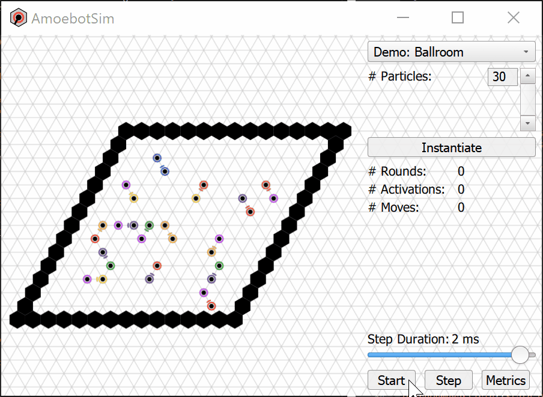

.. _token-demo:

TokenDemo: Communicating over Distance
--------------------------------------

In this tutorial, you will learn how to utilize token passing in AmoebotSim, including creating custom token types containing structured data.
We'll be developing **TokenDemo**, a simple algorithm where a ring (hexagon) of particles will pass tokens around, changing colors based on what tokens they are holding.
You can follow along with this tutorial by referencing the completed ``alg/demo/tokendemo.*`` files in AmoebotSim.
These instructions assume that you've read the previous tutorials and are familiar with AmoebotSim basics.

A Primer on Token Passing
^^^^^^^^^^^^^^^^^^^^^^^^^

In the amoebot model, a *token* is a constant-size piece of information that can be passed between particles for long-range communication.
Every token in AmoebotSim is derived from the base ``Token`` struct.
This base token contains no structured data, but it appears in the definitions of the core functions for handling tokens found in the ``AmoebotParticle`` class in ``core/amoebotparticle.h``.
Many of these functions are *templates*, which are used to restrict their scope to a specific token type.

.. cpp:function:: void putToken(std::shared_ptr<Token> token)

  Add the given token pointer to this particle's collection.

.. cpp:function:: template<class TokenType> \
                  std::shared_ptr<TokenType> peekAtToken()

  Get a reference to the first token in this particle's collection of the specified type.

.. cpp:function:: template<class TokenType> \
                  std::shared_ptr<TokenType> takeToken()

  Performs the same operation as ``peekAtToken()``, but additionally removes the returned reference from this particle's collection.

.. cpp:function:: template<class TokenType> \
                  int countTokens()

  Counts the number of tokens in this particle's collection of the specified type.

.. cpp:function:: template<class TokenType> \
                  bool hasToken()

  Checks whether this particle's collection contains at least one token of the specified type (equivalent to ``countTokens() > 0``).

.. tip::

  The four template functions also have overloaded versions that additionally take a custom property as input. For example, the overloaded version of ``countTokens()`` only counts the tokens of the specified type that also satisfy the input property. See ``core/amoebotparticle.h`` for more details.

Algorithm Description
^^^^^^^^^^^^^^^^^^^^^

The goal of **TokenDemo** is to pass tokens of two types, ``RedToken`` and ``BlueToken``, in opposite directions around a ring of particles.
To achieve this, each token will keep track of ``_passedFrom``, the direction it was last passed from.
If a token is being passed for the first time, its particle must choose a consistent passing direction for ``RedTokens`` and the opposite direction for ``BlueTokens``.
Every particle has exactly two neighbors on the ring, so as long as ``_passedFrom`` is properly maintained, continuing to pass a token in the same direction is straightforward.

Each token will also keep track of its ``_lifetime`` which is decremented each time it is passed.
Once its ``_lifetime`` is zero, the token should be deleted.

Setting Up the Files
^^^^^^^^^^^^^^^^^^^^

We begin by creating the ``alg/demo/tokendemo.h`` and ``alg/demo/tokendemo.cpp`` files and setting up their structure.
Just as with other new particle types, we inherit from ``AmoebotParticle`` and set up the necessary function overrides in ``alg/demo/tokendemo.h``.

.. code-block:: c++

  /* Copyright (C) 2021 Joshua J. Daymude, Robert Gmyr, and Kristian Hinnenthal.
   * The full GNU GPLv3 can be found in the LICENSE file, and the full copyright
   * notice can be found at the top of main/main.cpp. */

  // Defines a particle system and composing particles for the TokenDemo code
  // tutorial. TokenDemo demonstrates token passing functionality, including
  // defining new token types, modifying token memory contents, and passing tokens
  // between particles. The description and tutorial is available in the docs:
  // [https://amoebotsim.rtfd.io/en/latest/tutorials/tutorials.html#tokendemo-communicating-over-distance].

  #ifndef AMOEBOTSIM_ALG_DEMO_TOKENDEMO_H_
  #define AMOEBOTSIM_ALG_DEMO_TOKENDEMO_H_

  #include "core/amoebotparticle.h"
  #include "core/amoebotsystem.h"

  class TokenDemoParticle : public AmoebotParticle {
   public:
    // Constructs a new particle with a node position for its head, a global
    // compass direction from its head to its tail (-1 if contracted), an offset
    // for its local compass, and a system which it belongs to.
    TokenDemoParticle(const Node& head, const int globalTailDir,
                      const int orientation, AmoebotSystem& system);

    // Executes one particle activation.
    void activate() override;

    // Returns the color to be used for the ring drawn around the head node. In
    // this case, it returns the color of the token(s) this particle is holding.
    int headMarkColor() const override;

    // Returns the string to be displayed when this particle is inspected; used
    // to snapshot the current values of this particle's memory at runtime.
    QString inspectionText() const override;

    // Gets a reference to the neighboring particle incident to the specified port
    // label. Crashes if no such particle exists at this label; consider using
    // hasNbrAtLabel() first if unsure.
    TokenDemoParticle& nbrAtLabel(int label) const;

   protected:
    // TODO: define token types.

   private:
    friend class TokenDemoSystem;
  };

  // ...

  #endif  // AMOEBOTSIM_ALG_DEMO_TOKENDEMO_H_

We next add the token type definitions that **TokenDemo** will use.
``DemoToken`` will serve as the base token struct for this algorithm, storing both the ``_passedFrom`` and ``_lifetime`` member variables.
``RedToken`` and ``BlueToken`` are derived from ``DemoToken``.

.. code-block:: c++

  // ...

   protected:
    // Token types. DemoToken is a general type that has two data members:
    // (i) _passedFrom, which denotes the direction from which the token was last
    // passed (initially -1, meaning it has not yet been passed), and (ii)
    // _lifetime, which is decremented each time the token is passed. The red and
    // blue tokens are two types of DemoTokens.
    struct DemoToken : public Token { int _passedFrom = -1; int _lifetime; };
    struct RedToken : public DemoToken {};
    struct BlueToken : public DemoToken {};

  // ...

As with other algorithms, the last addition to ``alg/demo/tokendemo.h`` is the declaration of a new particle system type inheriting from ``AmoebotSystem``.
Because this algorithm has a termination condition (when all tokens have died out), we include an override for ``hasTerminated()``.

.. code-block:: c++

  class TokenDemoSystem : public AmoebotSystem {
   public:
    // Constructs a system of TokenDemoParticles with an optionally specified size
    // (#particles) and token lifetime.
    TokenDemoSystem(int numParticles = 48, int lifetime = 100);

    // Returns true when the simulation has completed; i.e, when all tokens have
    // died out.
    bool hasTerminated() const override;
  };

We complete our setup with a skeleton of ``alg/demo/tokendemo.cpp``.

.. code-block:: c++

  /* Copyright (C) 2021 Joshua J. Daymude, Robert Gmyr, and Kristian Hinnenthal.
   * The full GNU GPLv3 can be found in the LICENSE file, and the full copyright
   * notice can be found at the top of main/main.cpp. */

  #include "alg/demo/tokendemo.h"

  TokenDemoParticle::TokenDemoParticle(const Node& head, const int globalTailDir,
                                       const int orientation,
                                       AmoebotSystem& system) {}

  void TokenDemoParticle::activate() {}

  int TokenDemoParticle::headMarkColor() const {}

  QString TokenDemoParticle::inspectionText() const {}

  TokenDemoParticle& TokenDemoParticle::nbrAtLabel(int label) const {}

  TokenDemoSystem::TokenDemoSystem(int numParticles, int lifetime) {}

  bool TokenDemoSystem::hasTerminated() const {}

Function Implementations
^^^^^^^^^^^^^^^^^^^^^^^^

We'll now implement each function, working our way up from the simplest to the more complex.
As an advanced tutorial, we will skip the implementations of the ``TokenDemoParticle`` constructor and ``nbrAtLabel()`` since they are straightforward and do not involve token handling.
See ``alg/demo/tokendemo.cpp`` for more details.

The ``headMarkColor()`` function, as in other algorithms, uses a series of conditionals to decide what color to circle this particle with.
In **TokenDemo**, we color the particles based on the type of token(s) they're holding: a particle holding a ``RedToken`` is colored red, a particle holding a ``BlueToken`` is colored blue, and a particle holding both types is colored purple.
Here, we make use of the ``hasToken()`` function to check what types of tokens the particle is holding.

.. code-block:: c++

  int TokenDemoParticle::headMarkColor() const {
    if (hasToken<RedToken>() && hasToken<BlueToken>()) {
      return 0xff00ff;
    } else if (hasToken<RedToken>()) {
      return 0xff0000;
    } else if (hasToken<BlueToken>()) {
      return 0x0000ff;
    } else {
      return -1;
    }
  }

In addition to the usual global information, **TokenDemo**'s ``inspectionText()`` uses ``countTokens()`` to display the number of each token type the particle is holding.

.. code-block:: c++

  QString TokenDemoParticle::inspectionText() const {
    QString text;
    text += "Global Info:\n";
    text += "  head: (" + QString::number(head.x) + ", "
                        + QString::number(head.y) + ")\n";
    text += "  orientation: " + QString::number(orientation) + "\n";
    text += "  globalTailDir: " + QString::number(globalTailDir) + "\n\n";
    text += "Local Info:\n";
    text += "  # RedTokens: " + QString::number(countTokens<RedToken>()) + "\n";
    text += "  # BlueTokens: " + QString::number(countTokens<BlueToken>());

    return text;
  }

The ``hasTerminated()`` function in ``TokenDemoSystem`` stops the simulation when it evaluates to true.
We want **TokenDemo** to terminate after all its tokens have died out, since there is nothing more to do at that point.
This is best implemented as a for-loop over all particles, checking if any still hold a token using ``hasToken()``.
Note that we leverage the encapsulation of both colored token types by checking for ``DemoToken``.

.. code-block:: c++

  bool TokenDemoSystem::hasTerminated() const {
    for (auto p : particles) {
      auto tdp = dynamic_cast<TokenDemoParticle*>(p);
      if (tdp->hasToken<TokenDemoParticle::DemoToken>()) {
        return false;
      }
    }

    return true;
  }

We want the ``TokenDemoSystem`` constructor to instantiate a hexagonal ring of particles and then add some fixed number of tokens to the system.
To create the ring, we leverage the :ref:`hexagon building technique <disco-system-constructor>` introduced in **DiscoDemo**, but instead of placing objects, we place particles.
Using ``std::make_shared`` and ``putToken()``, we add five tokens of each color to the first particle; i.e., the one at ``(0,0)``.
We also initialize these token's ``_lifetime`` variables according to the input parameter.

.. code-block:: c++

  TokenDemoSystem::TokenDemoSystem(int numParticles, int lifetime) {
    Q_ASSERT(numParticles >= 6);

    // Instantiate a hexagon of particles.
    int sideLen = static_cast<int>(std::round(numParticles / 6.0));
    Node hexNode = Node(0, 0);
    for (int dir = 0; dir < 6; ++dir) {
      for (int i = 0; i < sideLen; ++i) {
        // Give the first particle five tokens of each color.
        if (hexNode.x == 0 && hexNode.y == 0) {
          auto firstP = new TokenDemoParticle(Node(0, 0), -1, randDir(), *this);
          for (int j = 0; j < 5; ++j) {
            auto redToken = std::make_shared<TokenDemoParticle::RedToken>();
            redToken->_lifetime = lifetime;
            firstP->putToken(redToken);
            auto blueToken = std::make_shared<TokenDemoParticle::BlueToken>();
            blueToken->_lifetime = lifetime;
            firstP->putToken(blueToken);
          }
          insert(firstP);
        } else {
          insert(new TokenDemoParticle(hexNode, -1, randDir(), *this));
        }

        hexNode = hexNode.nodeInDir(dir);
      }
    }
  }

We conclude with the ``activate()`` function for ``TokenDemoParticle``.
This is split into four main parts:

1. *Retrieving a token*. We first check if this particle is holding a token of either color by using ``hasToken<DemoToken>()``, again leveraging the encapsulation of both colored token types by ``DemoToken``. If this is the case, we use ``takeToken<DemoToken>()`` to take the first such token out of this particle's collection.

2. *Calculating where to pass the token*. The exact details of this calculation are beside the point of this token-passing tutorial, but there is an important detail. If a token has not yet been passed, then the particle holding it needs to consistently pass ``RedTokens`` in one direction and ``BlueTokens`` in the other. To check what type of token we're dealing with, we use ``std::dynamic_pointer_cast<type>(token)`` which will be non-empty if and only if ``token`` is of type ``type``.

3. *Updating* ``_passedFrom`` *according to how the token is about to be passed*. This involves a simple for-loop that checks which neighbor direction points at this particle. Once the correct direction is found, the token's ``_passedFrom`` variable is accessed and updated.

4. *Passing the token if and only if it has* ``_lifetime`` *remaining*. We access and check the token's ``_lifetime`` variable to see if we should pass it on. If ``_lifetime == 0``, then we simply do nothing. Since we used ``takeToken()`` to remove this token from the particle's collection, doing nothing means it will cease to exist at the end of this ``activate()`` function. Otherwise, if it does have ``_lifetime`` remaining, we decrement it and use ``putToken()`` to pass it to the desired neighbor.

.. code-block:: c++

  void TokenDemoParticle::activate() {
    if (hasToken<DemoToken>()) {
      std::shared_ptr<DemoToken> token = takeToken<DemoToken>();

      // Calculate the direction to pass this token.
      int passTo;
      if (token->_passedFrom == -1) {
        // This hasn't been passed yet; pass red and blue in opposite directions.
        int sweepLen = (std::dynamic_pointer_cast<RedToken>(token)) ? 1 : 2;
        // ...
      } else {
        // This has been passed before; pass continuing in the same direction.
        // ...
      }

      // Update the token's _passedFrom direction. Needs to point at this particle
      // from the perspective of the next neighbor.
      for (int nbrLabel = 0; nbrLabel < 6; nbrLabel++) {
        if (pointsAtMe(nbrAtLabel(passTo), nbrLabel)) {
          token->_passedFrom = nbrLabel;
          break;
        }
      }

      // If the token still has lifetime remaining, pass it on.
      if (token->_lifetime > 0) {
        token->_lifetime--;
        nbrAtLabel(passTo).putToken(token);
      }
    }
  }

Wrapping Up
^^^^^^^^^^^^^

As in the other tutorials, the last step is to :ref:`register the algorithm <disco-register>` in the same way we did with **DiscoDemo**.
Compiling and running AmoebotSim after completing these steps will allow you to instantiate the **TokenDemo** simulation using the sidebar interface.
Well done!

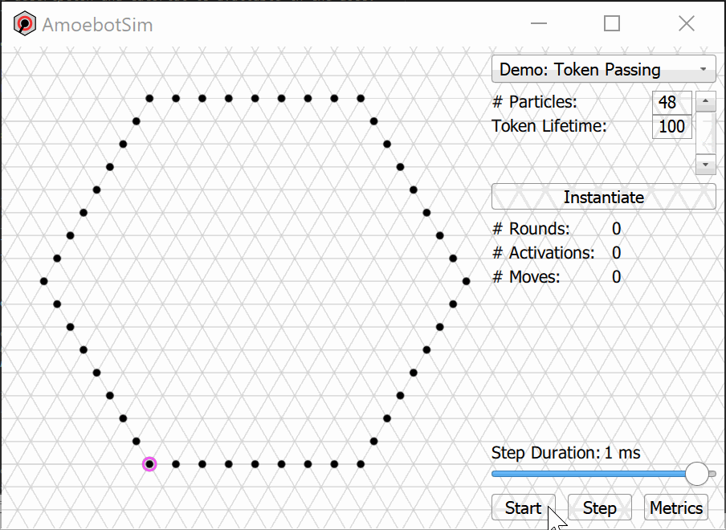

.. tip::

  If you're interested in more advanced examples of token passing, consider studying the implementations of the leader election algorithms in AmoebotSim.

.. _metrics-demo:

MetricsDemo: Capturing Data
---------------------------

This tutorial covers custom metrics that can be added to AmoebotSim algorithms.
Metrics allow you, as the developer, to monitor and record any quantitative aspect of the particle system at hand.
AmoebotSim metrics are broken up into two different classes:

- *Counts* track the number of times a certain event happens, and thus are always increasing (e.g., usually incrementing once per event). For example, AmoebotSim's default metrics tracking the number of rounds elapsed, the number of particles activated, and the number of particle movements made are all implemented as counts.

- *Measures* track system properties based on a global, complete view of all particle positions and memory contents. For example, the **Compression** algorithm in ``alg/compression.*`` uses a measure to track the perimeter of the system as it fluctuates over time.

Here, we'll develop **MetricsDemo**, an extension of **DiscoDemo** that adds three separate metrics: (1) a count for the number of times particles bump into the boundary wall, (2) a measure for the percentage of particles that are red, and (3) and a more complex measure for the maximum distance between any pair of particles.
This tutorial assumes that you have read and are comfortable with the **DiscoDemo** :ref:`tutorial <disco-demo>`; feel free to follow along with these instructions while referencing the completed ``alg/demo/metricsdemo.*`` files.

Setting Up the Files
^^^^^^^^^^^^^^^^^^^^

Our goal is to add metrics to the **DiscoDemo** simulation, so we begin by creating the ``alg/demo/metricsdemo.h`` and ``alg/demo/metricsdemo.cpp`` files as copies of the ``alg/demo/discodemo.h`` and ``alg/demo/discodemo.cpp`` files, respectively.
Next, change any instance of "DiscoDemo" in your new files to "MetricsDemo" (i.e., update ``DiscoDemoParticle`` to ``MetricsDemoParticle``, ``DiscoDemoSystem`` to ``MetricsDemoSystem``, etc.).
Don't forget to update your header comment and ``#define`` guards!

Next, :ref:`register <disco-register>` this new **MetricsDemo** algorithm in the same way we did with **DiscoDemo** using the same parameters, parameter checking, system instantiation, etc.
Compiling and running AmoebotSim at this point will give you a **MetricsDemo** that is essentially identical to the **DiscoDemo** simulation you created in the previous tutorial.

You are now ready to create your first custom metrics!

Counting Particle Wall Bumps
^^^^^^^^^^^^^^^^^^^^^^^^^^^^

Recall that *Counts* track the number of times a certain event has happened so far.
Before we create our custom count, let's take a look at its class definition in ``core/metric.h``.

.. code-block:: c++

  class Count {
   public:
    // Constructs a new count initialized to zero.
    Count(const QString name);

    // Increments the value of this count by the number of events being recorded,
    // whose default is 1.
    void record(const unsigned int numEvents = 1);

    // Member variables. The count's name should be human-readable, as it is used
    // to represent this count in the GUI. The value of the count is what is
    // incremented. History records the count values over time, once per round.
    const QString _name;
    unsigned int _value;
    std::vector<int> _history;
  };

Each ``Count`` object has a human readable ``_name``, a current ``_value`` (initialized to zero), and a ``_history`` that tracks the count value over time.
As the constructor shows, creating a custom ``Count`` is as simple as instantiating it with a name.
It can then be added it to a particle system's ``_counts`` vector, which every system class derived from ``AmoebotSystem`` has.
For a first custom metric in **MetricsDemo**, we want to count the number of times *a particle bumps into the boundary wall*, which we instantiate in the ``MetricsDemoSystem`` constructor in ``alg/demo/metricsdemo.cpp``.

.. code-block:: c++

  MetricsDemoSystem::MetricsDemoSystem(unsigned int numParticles, int counterMax) {
    // ...

    // Set up metrics.
    _counts.push_back(new Count("# Wall Bumps"));
  }

The ``Count`` class's ``record()`` function is used to register each time the event of interest occurs, incrementing the ``_value`` of the count according to the ``numEvents`` parameter.
By default ``numEvents = 1`` (and can thus be omitted), but this can be set to a larger value if desired.
The ``record()`` function is placed in a particle's ``activate()`` function wherever the event of interest would be identified.
In our case, we want to call ``record()`` whenever a ``MetricsDemoParticle`` "bumps" into the boundary wall, where we consider a "bump" any time that a particle is unable to move because of the wall being in its way.
The **DiscoDemo** :ref:`pseudocode <disco-pseudocode>` for particles "dancing" within the boundary is easily modified to detect this event:::

  if (P is contracted), then do:
    expandDir <- random direction in [0, 6)
    if (node in direction expandDir is empty), then do:
      expand towards expandDir
    // MetricsDemo, new else-if:
    else if (node in direction expandDir is occupied by an object), then do:
      // This particle has "bumped" into the boundary wall!
    end if
  else, do:  // P is expanded
    contract tail
  end if

Now, we'll add this to the ``activate()`` function of ``MetricsDemoParticle`` in ``alg/demo/metricsdemo.cpp``.
We access our wall bumps count using the ``getCount`` function, which searches for counts by name.

.. code-block:: c++

  void MetricsDemoParticle::activate() {
    // ...

    if (isContracted()) {
      int expandDir = randDir();
      if (canExpand(expandDir)) {
        expand(expandDir);
      } else if (hasObjectAtLabel(expandDir)) {
        system.getCount("# Wall Bumps").record();
      }
    } else {  // isExpanded().
      contractTail();
    }
  }

And that's it! You've just created your first custom metric.
Running AmoebotSim with these changes, we can see our wall bumps count added just below the other default metrics.

Measuring the Percentage of Red Particles
^^^^^^^^^^^^^^^^^^^^^^^^^^^^^^^^^^^^^^^^^

Recall that *Measures* track system properties based on a global view of all particles, and thus can fluctuate over time.
Before we create our custom measure, let's take a look at its class definition in ``core/metric.h``:

.. code-block:: c++

  class Measure {
   public:
    // Constructs a new measure with a given name and calculation frequency.
    Measure(const QString name, const unsigned int freq);
    virtual ~Measure();

    // Implements the measurement from the "global" perspective of the
    // AmoebotSystem being measured. Examples: calculate the percentage of
    // particles in a particular state, calculate the perimeter of a system, etc.
    // This is a pure virtual function and must be overridden by child classes.
    virtual double calculate() const = 0;

    // Member variables. The measure's name should be human-readable, as it is
    // used to represent this measure in the GUI. Frequency determines how often
    // the measure is calculated in terms of # of rounds. History records the
    // measure values over time, once per round.
    const QString _name;
    const unsigned int _freq;
    std::vector<double> _history;
  };

Similar to counts, the ``Measure`` class has a human-readable ``_name`` and a ``_history`` that tracks the measure value over time.
Unlike counts, however, measures have no need to keep a current value.
Instead, the ``calculate()`` function is called once every ``_freq`` rounds to compute a new measure value, which is then appended to ``_history``.
Whereas for counts the ``record()`` function is already defined and the main work is incorporating it in a particle's ``activate()`` function, measures require a custom definition of the ``calculate()`` function but are called automatically.

We'll create a custom measure that tracks the *percentage of particles in the system that are red*.
To do this, we add a class ``PercentRedMeasure`` that inherits from ``Measure`` in ``alg/demo/metricsdemo.h``.

.. code-block:: c++

  class PercentRedMeasure : public Measure {
   public:
    // Constructs a PercentRedMeasure by using the parent constructor and adding a
    // reference to the MetricsDemoSystem being measured.
    PercentRedMeasure(const QString name, const unsigned int freq,
                      MetricsDemoSystem& system);

    // Calculated the percentage of particles in the system in the Red state.
    double calculate() const final;

   protected:
    MetricsDemoSystem& _system;
  };

Because our measure will need access to the system's particles and those particles' memories (to check if they are red), we need to make ``PercentRedMeasure`` a `friend class <http://www.cplusplus.com/doc/tutorial/inheritance/>`_ of both ``MetricsDemoSystem`` and ``MetricsDemoParticle``.
Otherwise, our measure will not have access to the system and particles' ``protected`` members, such as the list of particles or their memory contents.

.. code-block:: c++

  class MetricsDemoParticle : public AmoebotParticle {
    friend class PercentRedMeasure;

    // ...
  };

  class MetricsDemoSystem : public AmoebotSystem {
    friend class PercentRedMeasure;

    // ...
  };

.. note::

  While a custom measure class must always be a friend class of the system class it's measuring, it may not need to be a friend class of the corresponding particle class if it does not need information from particles' memories.

Turning now to the source file ``alg/demo/metricsdemo.cpp``, we first add an instance of our new ``PercentRedMeasure`` to the ``MetricsDemoSystem``.
Similar to what we did for counts, this takes place in the system's constructor by adding an instance of our measure to the system's ``_measures`` vector.
Here, we specify a frequency of ``1``, meaning that we would like this measure to be calculated at the end of every round.

.. code-block:: c++

  MetricsDemoSystem::MetricsDemoSystem(unsigned int numParticles, int counterMax) {
    // ...

    // Set up metrics.
    _counts.push_back(new Count("# Wall Bumps"));
    _measures.push_back(new PercentRedMeasure("% Red", 1, *this));
  }

The ``PercentRedMeasure`` constructor is straightforward, calling its parent constructor with the input name and frequency and then assigning the system reference.

.. code-block:: c++

  PercentRedMeasure::PercentRedMeasure(const QString name,
                                       const unsigned int freq,
                                       MetricsDemoSystem& system)
      : Measure(name, freq),
        _system(system) {}

The most important part of every custom measure is the implementation of its ``calculate()`` function.
For ``PercentRedMeasure``, we want to tally the total number of particles in ``State::Red`` and divide that by the total number of particles in the system to obtain the percentage of red particles.
This implementation is fairly straightforward, with two caveats.
First, because the system's collection of particles is defined at the ``AmoebotSystem``/``AmoebotParticle`` level, the pointer must first be cast as a ``MetricsDemoParticle*`` in order to access its ``_state``.
Second, we need to take care that the final fraction of red particles is calculated with floating point division instead of integer division.

.. code-block:: c++

  double PercentRedMeasure::calculate() const {
    int numRed = 0;

    // Loop through all particles of the system.
    for (const auto& p : _system.particles) {
      // Convert the pointer to a MetricsDemoParticle so its color can be checked.
      auto metr_p = dynamic_cast<MetricsDemoParticle*>(p);
      if (metr_p->_state == MetricsDemoParticle::State::Red) {
        numRed++;
      }
    }

    return numRed / static_cast<double>(_system.size()) * 100;
  }

Great, you've just finished your first custom measure!
Running AmoebotSim now, we can see our "% Red" measure just below our custom "# Wall Bumps" count and the default metrics.

Measuring the Maximum Pairwise Particle Distance
^^^^^^^^^^^^^^^^^^^^^^^^^^^^^^^^^^^^^^^^^^^^^^^^

By this point, you've already learned how to create your own custom metrics, both a count and a measure.
Here, we are going to leverage the global information available to measures to monitor the *maximum Cartesian distance between any pair of particles in the system*.
This last measure will have the same format and setup as outlined in the previous section, but will have a more complicated ``calculate()`` function.

In ``alg/demo/metricsdemo.h``, following the same steps as for ``PercentRedMeasure``, define a new measure class ``MaxDistanceMeasure`` that inherits from ``Measure`` and make it a friend of ``MetricsDemoSystem``.
(We only need particle coordinates to calculate pairwise distance, so we do not need the particle memory access that comes being a friend class of ``MetricsDemoParticle``).

.. code-block:: c++

  class MetricsDemoSystem : public AmoebotSystem {
    friend class PercentRedMeasure;
    friend class MaxDistanceMeasure;

    // ...
  };

  // ...

  class MaxDistanceMeasure : public Measure {
   public:
    // Constructs a MaxDistanceMeasure by using the parent constructor and adding
    // a reference to the MetricsDemoSystem being measured.
    MaxDistanceMeasure(const QString name, const unsigned int freq,
                       MetricsDemoSystem& system);

    // Calculates the largest Cartesian distance between any pair of particles in
    // the system.
    double calculate() const final;

   protected:
    MetricsDemoSystem& _system;
  };

Moving on to ``alg/demo/metricsdemo.cpp``, add an instance of ``MaxDistanceMeasure`` to ``MetricsDemoSystem`` in its constructor and define the ``MaxDistanceMeasure`` constructor, just as you did in the last section.

.. code-block:: c++

  MetricsDemoSystem::MetricsDemoSystem(unsigned int numParticles, int counterMax) {
    // ...

    // Set up metrics.
    _counts.push_back(new Count("# Wall Bumps"));
    _measures.push_back(new PercentRedMeasure("% Red", 1, *this));
    _measures.push_back(new MaxDistanceMeasure("Max. Distance", 1, *this));
  }

  // ...

  MaxDistanceMeasure::MaxDistanceMeasure(const QString name,
                                         const unsigned int freq,
                                         MetricsDemoSystem& system)
      : Measure(name, freq),
        _system(system) {}

Finally, we need to write the measure's ``calculate()`` function so that it loops over all pairs of particles and calculates the Cartesian pairwise distance between them, returning the largest such distance.
(This is as opposed to the L1-distance along edges of the lattice).
However, as we saw in **DiscoDemo**, particle coordinates are given on the triangular lattice.

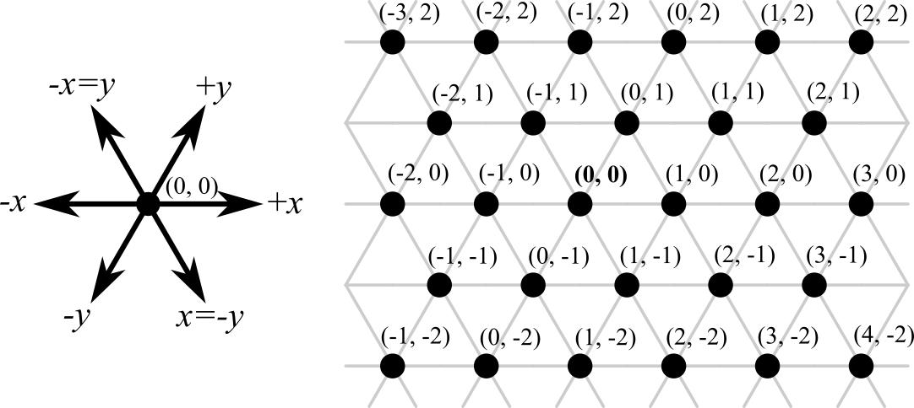

As a result, we need to convert the triangular lattice coordinates to Cartesian coordinates before calculating the distance between two points.
This conversion is given by: ::

  x_cart = x_tri + (y_tri / 2)
  y_cart = (sqrt(3) / 2) * y_tri

Once converted to Cartesian coordinates, distance can be calculated using the typical formula. ::

  dist = sqrt((x2_cart - x1_cart)^2 + (y2_cart - y1_cart)^2);

With these pieces in place, the full implementation of the ``calculate()`` function for ``MaxDistanceMeasure`` is straightforward.
(This particular double for-loop implementation is meant for clarity and not efficiency).

.. code-block:: c++

  double MaxDistanceMeasure::calculate() const {
    double maxDist = 0.0;
    for (const auto& p1 : _system.particles) {
      double x1 = p1->head.x + p1->head.y / 2.0;
      double y1 = std::sqrt(3.0) / 2 * p1->head.y;
      for (const auto& p2 : _system.particles) {
        double x2 = p2->head.x + p2->head.y / 2.0;
        double y2 = std::sqrt(3.0) / 2 * p2->head.y;
        maxDist = std::max(std::sqrt(std::pow(x2 - x1, 2) + std::pow(y2 - y1, 2)),
                           maxDist);
      }
    }

    return maxDist;
  }

This completes **MetricsDemo**, which now has all three of its custom metrics. Great job!

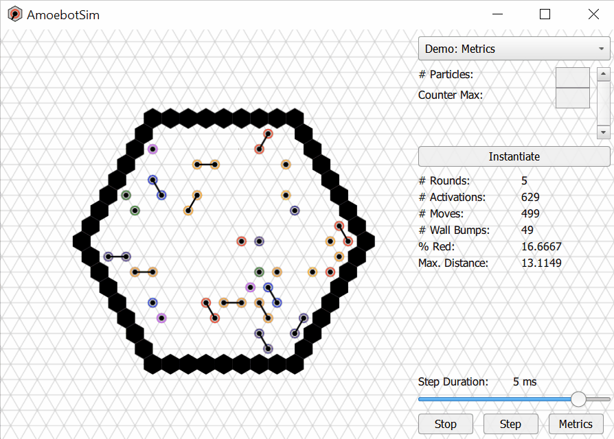

Exporting Data
^^^^^^^^^^^^^^

AmoebotSim automatically tracks metrics and stores their historical data, which can be exported as a JSON for further analysis or plotting.
To export metrics data, you can either use the *Metrics* button (shown below) or use the keyboard shortcut ``Ctrl+E`` on Windows or ``Cmd+E`` on macOS.

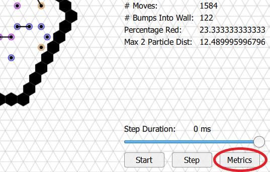

This writes the metrics file with all of the historical data as ``your_build_directory/metrics/metrics_<secs_since_epoch>.json``.
You can read more about the structure and format of these JSON data files under :ref:`Exporting Metrics Data <usage-export-metrics-data>` in Usage.
The exported data can then be post-processed, analyzed, and plotted using your favorite analysis tools (e.g., `matplotlib <https://matplotlib.org/>`_, `MATLAB <https://www.mathworks.com/products/matlab.html>`_, etc.).

.. _dynamic_demo:

DynamicDemo: Adding and Removing Particles
------------------------------------------

In this tutorial, you will learn how to add and remove particles at runtime, enabling the simulation of systems that dynamically grow or shrink.
While this is not a functionality that is explicitly assumed by the amoebot model, it is a reasonable extension that has been used, e.g., in the conclusion of `this paper <https://arxiv.org/abs/2007.04377>`_.
We'll be developing **DynamicDemo**, an algorithm where particles grow and/or die in their activations based on fixed probabilities.
The completed ``alg/demo/dynamicdemo.*`` files are available in AmoebotSim for you to follow along.
This tutorial assumes you have read and are comfortable with the **DiscoDemo** :ref:`tutorial <disco-demo>`.

Algorithm Description
^^^^^^^^^^^^^^^^^^^^^

Each particle has two fixed probabilities: a growth probability ``_growProb`` and a death probability ``_dieProb``.
On activation, a particle adds a new particle in a random unoccupied adjacent node with probability ``_growProb`` and then removes itself with probability ``_dieProb``.

Setting Up the Files
^^^^^^^^^^^^^^^^^^^^

We begin by creating the ``alg/demo/dynamicdemo.h`` and ``alg/demo/dynamicdemo.cpp`` files and setting up their structure.
As in the other tutorials, we set up our ``DynamicDemoParticle`` by inheriting from ``AmoebotParticle`` and defining the necessary function overrides in ``alg/demo/dynamicdemo.h``.

.. code-block:: c++

  /* Copyright (C) 2021 Joshua J. Daymude, Robert Gmyr, and Kristian Hinnenthal.
  * The full GNU GPLv3 can be found in the LICENSE file, and the full copyright
  * notice can be found at the top of main/main.cpp. */

  // Defines the particle system and composing particles for the DynamicDemo code
  // tutorial. DynamicDemo demonstrates how to add and remove particles from the
  // system at runtime. The pseudocode is available in the docs:
  // [https://amoebotsim.rtfd.io/en/latest/tutorials/tutorials.html#dynamicdemo-adding-and-removing-particles].

  #ifndef AMOEBOTSIM_ALG_DEMO_DYNAMICDEMO_H_
  #define AMOEBOTSIM_ALG_DEMO_DYNAMICDEMO_H_

  #include "core/amoebotparticle.h"
  #include "core/amoebotsystem.h"

  class DynamicDemoParticle : public AmoebotParticle {
   public:
    // Constructs a new particle with a node position for its head, a global
    // compass direction from its head to its tail (-1 if contracted), an offset
    // for its local compass, a system which it belongs to, and growth and death
    // probabilities.
    DynamicDemoParticle(const Node& head, const int globalTailDir,
                        const int orientation, AmoebotSystem& system,
                        const double growProb, const double dieProb);

    // Executes one particle activation.
    void activate() override;

    // Returns the string to be displayed when this particle is inspected; used
    // to snapshot the current values of this particle's memory at runtime.
    QString inspectionText() const override;

   protected:
    // Member variables.
    const double _growProb;
    const double _dieProb;

   private:
    friend class DynamicDemoSystem;
  };

  // ...

  #endif  // AMOEBOTSIM_ALG_DEMO_DYNAMICDEMO_H_

We next declare a ``DynamicDemoSystem`` inheriting from ``AmoebotSystem``.
Because this algorithm has a termination condition (when all particles have died), we include an override for ``hasTerminated()``.

.. code-block:: c++

  class DynamicDemoSystem : public AmoebotSystem {
   public:
    // Constructs a system of DynamicDemoParticles with an optionally specified
    // size (#particles) and particle growth and death probabilities.
    DynamicDemoSystem(unsigned int numParticles = 10, double growProb = 0.02,
                      double dieProb = 0.01);

    // Returns true when the simulation has completed; i.e, when all particles
    // have died.
    bool hasTerminated() const override;
  };

We complete our setup with a skeleton of ``alg/demo/dynamicdemo.cpp``.

.. code-block:: c++

  /* Copyright (C) 2021 Joshua J. Daymude, Robert Gmyr, and Kristian Hinnenthal.
   * The full GNU GPLv3 can be found in the LICENSE file, and the full copyright
   * notice can be found at the top of main/main.cpp. */

  # include "alg/demo/dynamicdemo.h"

  DynamicDemoParticle::DynamicDemoParticle(const Node& head,
                                           const int globalTailDir,
                                           const int orientation,
                                           AmoebotSystem& system,
                                           const double growProb,
                                           const double dieProb)
      : AmoebotParticle(head, globalTailDir, orientation, system),
        _growProb(growProb),
        _dieProb(dieProb) {}

  void DynamicDemoParticle::activate() {}

  QString DynamicDemoParticle::inspectionText() const {}

  DynamicDemoSystem::DynamicDemoSystem(unsigned int numParticles, double growProb,
                                       double dieProb) {}

  bool DynamicDemoSystem::hasTerminated() const {}

Function Implementations
^^^^^^^^^^^^^^^^^^^^^^^^

We now turn to function implementations.
As an advanced tutorial, we will skip the implementations of the ``DynamicDemoParticle`` constructor and ``inspectionText()`` since they are straightforward.
We will also skip the implementation of the ``DynamicDemoSystem`` constructor; though it may appear complicated, all it is doing is placing newly instantiated particles in the shape of a hexagon.
See ``alg/demo/dynamicdemo.cpp`` for more details.

Instead, we focus on the functions that involve particle addition and removal.
We start with ``activate()``, which does the majority of the work:

.. code-block:: c++

  void DynamicDemoParticle::activate() {
    // With the specified growth probability, choose a random direction and add
    // a particle in the incident node if it is unoccupied.
    if (randDouble(0, 1) < _growProb) {
      int growDir = randDir();
      if (!hasNbrAtLabel(growDir)) {
        system.insert(new DynamicDemoParticle(
                        head.nodeInDir(localToGlobalDir(growDir)), -1, randDir(),
                        system, _growProb, _dieProb));
      }
    }

    // With the specified death probability, die (i.e., remove this particle).
    if (randDouble(0, 1) < _dieProb) {
      system.remove(this);
    }
  }

This particle adds a new particle to the system using ``system.insert(new DynamicDemoParticle(...))``.
Note that the insertion only occurs if the intended node is unoccupied; otherwise, we would be inserting a particle on top of another particle, which would cause AmoebotSim to crash.
Breaking down the parameters used in the particle addition:

- ``head.nodeInDir(localToGlobalDir(growDir))`` defines the head node for the new particle, translating the calling particle's local ``growDir`` to the coordinate actually being referenced.

- ``-1``, ``randDir()``, and ``system`` are the usual values for the tail direction, orientation, and system parameters.

- ``_growProb`` and ``_dieProb`` are the probabilities used in this **DynamicDemo** algorithm, and are passed to the newly added particle verbatim since all particles have the same growth and death probabilities.

This particle removes itself using ``system.remove(this)``, where ``this`` is the self-referencing pointer.

.. warning::

  If a particle removes itself, this should be the **last** instruction in the corresponding control flow of its ``activate()`` function.
  ``AmoebotSystem::remove(AmoebotParticle* particle)`` will free the memory associated with this particle (i.e., ``delete particle``), so any further instructions involving this particle will cause undefined behavior or crashes.

Since it is possible for all particles in the system to die, resulting in an empty system, we must implement ``DynamicDemoSystem::hasTerminated()`` in order to stop AmoebotSim from trying to activate nonexistent particles.

.. code-block:: c++

  bool DynamicDemoSystem::hasTerminated() const {
    return particles.size() == 0;
  }

Wrapping Up
^^^^^^^^^^^

As in the other tutorials, we conclude by :ref:`registering the algorithm <disco-register>`.
Compiling and running AmoebotSim will then allow you to instantiate the **DynamicDemo** simulation using the sidebar interface.

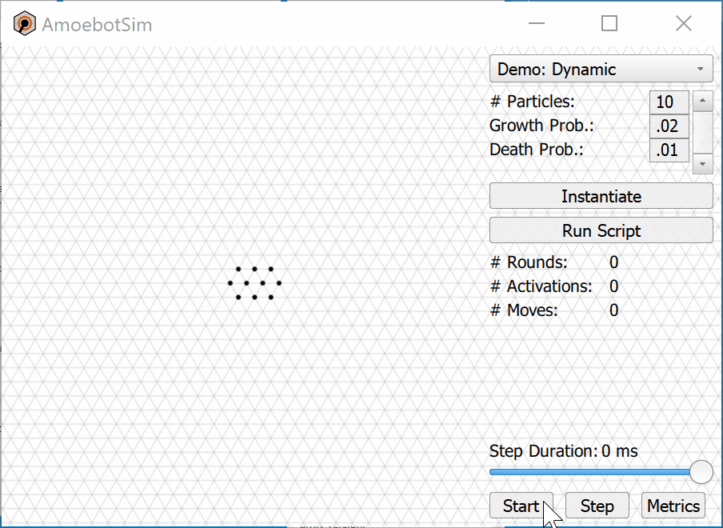
