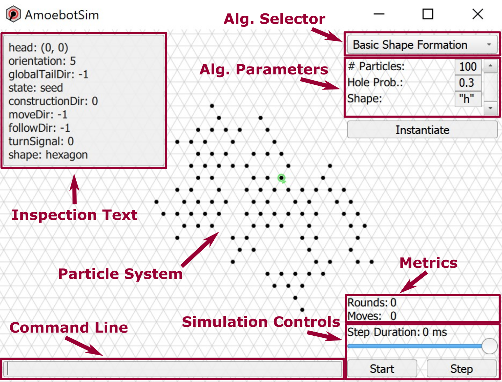

Usage
=====

This usage guide is for explorers 🔎, researchers 🧪, and developers 💻 learning how to use AmoebotSim's front-end user interface.

At A Glance
-----------

As a first introduction to AmoebotSim, we'll discuss the main parts of its interface:

- **Particle System**. The black dots represent individual particles, which can optionally display a color and a directional pointer. They live on the nodes of the triangular lattice (grey lines).
- **Algorithm Selector and Parameters**. Choose the algorithm you want to simulate from the dropdown menu, and add its parameters in the list. Pressing *Instantiate* will generate a new instance of that algorithm with the specified parameters.
- **Simulation Controls**. Pressing the *Start/Stop* button will start and stop the instanced simulation. When stopped, the *Step* button will execute a single particle activation. The *Step Duration* slider controls how fast the simulation proceeds.
- **Metrics**. These labels track different simulation statistics as it runs.
- **Inspection Text**. A particle's inspection text shows various information about its state.
- **Command Line**. The command line provides a front-end interface to AmoebotSim's JavaScript API, described more :ref:`below <command-line>`.

.. _controls:

Controls
--------

Left-click and drag to translate the scene, and use the scroll wheel to zoom in and out.
Interact with individual particles by using the following.

.. csv-table::
  :header: "Windows", "macOS", "The selected particle..."
  :widths: auto

  ``Ctrl`` + ``left click``, ``Cmd`` + ``left click``, ...executes a single activation
  ``Alt`` + ``left click``, ``Option`` + ``left click``, ...shows its inspection text

The following keyboard shortcuts are also available.

.. csv-table::
  :header: "Windows", "macOS", "Description"
  :widths: auto

  ``Ctrl+S``, ``Cmd+S``, Start/stop the current simulation
  ``Ctrl+D``, ``Cmd+D``, Execute a single particle activation
  ``Ctrl+F``, ``Cmd+F``, Focus the scene on the particle system
  ``Ctrl+H``, ``Cmd+H``, Hide/show UI elements (useful for presentations)
  ``Ctrl+E``, ``Cmd+E``, Export metrics data as JSON

.. _command-line:

Command Line
------------

AmoebotSim's command line can be opened by pressing ``Return``.
The following is a list of all recognized commands.

.. js:function:: log(msg, error)

  :param string msg: A message to log to the command line.
  :param boolean error: ``true`` if and only if this is an error message.

  Emits the message ``msg`` to the console, and can be denoted as an error message by setting ``error`` to ``true``.

.. todo::
  The script interface will likely no longer exist as a command line interface, but will still be available for scripting. So this section will likely need to move elsewhere or at least be presented differently.
  There would of course be more things exposed by ``ScriptInterface``, so we'll need to potentially add everything in there to an API area.

Exporting Metrics Data
----------------------

AmoebotSim supports metrics tracking for its algorithms. These metrics can be simple, such as the cumulative number of moves made by particles, or more complicated, such as the distance between the furthest pair of particles or the perimeter of a connected particle system. AmoebotSim automatically tracks these metrics and stores their historical data, which can be exported as a JSON for further analysis or plotting. Exporting metrics data (using either the *Metrics* button or ``Ctrl+E``/``Cmd+E``) writes the metrics file as ``metrics_<secs_since_epoch>.json`` to the application executable's directory. The structure of these JSON files is:

.. code-block::

  {
    "title" : "AmoebotSim Metrics JSON",
    "datetime" : str,
    "algorithm" : str,
    "counts" : [count],
    "measures" : [measure]
  }

  count : {
    "name" : str,
    "history" : [int]
  }

  measure : {
    "name" : str,
    "frequency" : int,
    "history" : [float]
  }

Details on implementing custom metrics and attaching them to algorithms can be found in the :ref:`MetricsDemo tutorial <metrics-demo>`.
